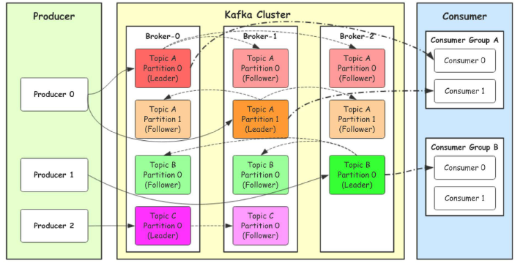
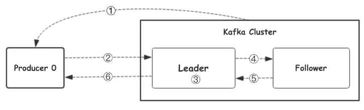

## MQ
1. MQ简介
   - 消息总线(Message Queue)，是一种跨进程、异步的通信机制，用于上下游传递消息。由消息系统来确保消息的可靠传递。
2. 适用场景
   - 上下游逻辑解耦&&物理解耦
   - 保证数据最终一致性
   - 广播
   - 错峰控流
## RabbitMQ
1. RabbitMQ特点
   - AMQP：Advanced Message Queue，高级消息队列协议。它是应用层协议的一个开放标准，为面向消息的中间件设计，基于此协议的客户端与消息中间件可传递消息，并不受产品、开发语言等条件的限制
   - 可靠性(Reliability)：使用了一些机制来保证可靠性，比如持久化、传输确认、发布确认
   - 灵活的路由(Flexible Routing)：在消息进入队列之前，通过Exchange来路由消息。对于典型的路由功能，Rabbit已经提供了一些内置的Exchange来实现。针对更复杂的路由功能，可以将多个Exchange绑定在一起，也通过插件机制实现自己的Exchange
   - 消息集群(Clustering)：多个RabbitMQ服务器可以组成一个集群，形成一个逻辑Broker。
   - 高可用(Highly Available Queues)：队列可以在集群中的机器上进行镜像，使得在部分节点出问题的情况下队列仍然可用。
   - 多种协议(Multi-protocol)：支持多种消息队列协议，如STOMP、MQTT等。
   - 多种语言客户端(Many Clients)：几乎支持所有常用语言，比如Java、.NET、Ruby等。
   - 管理界面(Management UI)：提供了易用的用户界面，使得用户可以监控和管理消息Broker的许多方面。
   - 跟踪机制(Tracing)：如果消息异常，RabbitMQ提供了消息的跟踪机制，使用者可以找出发生了什么。
   - 插件机制(Plugin System)：提供了许多插件，来从多方面进行扩展，也可以编辑自己的插件。
2. RabbitMQ六种工作模式
   - simple简单模式
     - 消息生产者将消息放入队列
     - 消息消费者监听消息队列， 如果队列中有消息，就消费掉，消息自动从队列中删除
     - 应用场景：聊天
   - work工作模式（资源的竞争）一个消息只能被一个消费者获取
     - 消息产生者将消息放入队列消费者可以有多个,消费者1,消费者2,同时监听同一个队列,消息被消费?C1 C2共同争抢当前的消息队列内容,谁先拿到谁负责消费消息
     - 比simple模式多了一个消费者，其他代码一致
     - 应用场景：红包，资源调度
   - publish/subscribe发布订阅（共享资源）消息被路由投递给多个队列， 一个消息被多个消费者获取
     - 消息产生者将消息放入交换机,交换机发布订阅把消息发送到所有消息队列中,对应消息队列的消费者拿到消息进行消费
     - 应用场景：邮件群发,群聊天,广播(广告)
   - routing路由模式 （一个消息被多个消费者获取，并且消息的目标队列可被生产者指定）
     - 消息生产者将消息发送给交换机按照路由判断,路由是字符串(info) 当前产生的消息携带路由字符(对象的方法),交换机根据路由的key,只能匹配上路由key对应的消息队列,对应的消费者才能消费消息;
     - 根据业务功能定义路由字符串
     - 从系统的代码逻辑中获取对应的功能字符串,将消息任务扔到对应的队列中业务场景
   - topic主题模式（路由模式的一种） 一个消息被多个消费者获取，消息的目标queue可用BindingKey以通配符，（#：一个或多个词，*：一个词）的方式指定
     - 星号井号代表通配符
     - 星号代表多个单词,井号代表一个单词
     - 路由功能添加模糊匹配
     - 消息产生者产生消息,把消息交给交换机
     - 交换机根据key的规则模糊匹配到对应的队列,由队列的监听消费者接收消息消费
   - RPC
     - 支持生产者和消费者不在同一个系统中，即允许远程调用的情况。通常，消费者作为服务端，放置在远程的系统中，提供接口，生产者调用接口，并发送消息。
     - 要实现rpc模式，生产者需要发送回调队列
     - 工作流程
       - 生产者（Client）开始生产消息后，创建了匿名的、独一无二的回调队列。 
       - 生产者（Client）发送请求时，包含两个属性：reply_to，即回调队列；correlation_id，即用于标记请求的属性。 
       - 请求（request ）被发送到rpc_queue队列。 
       - 消费者（The RPC worker）等待请求，收到时，其处理生产者发送的特定的reply_to的消息。 
       - 生产者等待消息的ack回复，当收到回复后，其校验correlation_id，如果正确则回到应用程序中。

## Kafka
1. Kafka特点
   - Kafka是**分布式**的，其所有的构件borker(服务端集群)、producer(消息生产)、consumer(消息消费者)都可以是分布式的。
   - 在消息的生产时可以使用一个标识topic来区分，且可以进行分区；每一个分区都是一个顺序的、不可变的消息队列， 并且可以持续的添加
   - 同时为发布和订阅提供高吞吐量。据了解，Kafka每秒可以生产约25万消息（50 MB），每秒处理55万消息（110 MB）。
   - 消息被处理的状态是在consumer端维护，而不是由server端维护。当失败时能自动平衡
2. 使用场景
   - 监控
   - 消息队列
   - 站点的用户活动追踪
   - 流处理
   - 日志聚合
   - 持久性日志
3. 基础概念
   - Topic(话题)：Kafka中用于区分不同类别信息的类别名称。由producer指定
   - Producer(生产者)：将消息发布到Kafka特定的Topic的对象(过程)
   - Consumers(消费者)：订阅并处理特定的Topic中的消息的对象(过程)
   - Broker(Kafka服务集群)：已发布的消息保存在一组服务器中，称之为Kafka集群。集群中的每一个服务器都是一个代理(Broker). 消费者可以订阅一个或多个话题，并从Broker拉数据，从而消费这些已发布的消息。
   - Partition(分区)：Topic物理上的分组，一个topic可以分为多个partition，每个partition是一个有序的队列。partition中的每条消息都会被分配一个有序的id（offset）
   - Message：消息，是通信的基本单位，每个producer可以向一个topic（主题）发布一些消息。
4. 架构

   - Producer：Producer即生产者，消息的产生者，是消息的⼊口
   - kafka cluster：kafka集群，一台或多台服务器组成
     - Broker：Broker是指部署了Kafka实例的服务器节点。每个服务器上有一个或多个kafka的实 例，我们姑且认为每个broker对应一台服务器。每个kafka集群内的broker都有一个不重复的 编号，如图中的broker-0、broker-1等……
     - Topic：消息的主题，可以理解为消息的分类，kafka的数据就保存在topic。在每个broker上 都可以创建多个topic。实际应用中通常是一个业务线建一个topic。
     - Partition：Topic的分区，每个topic可以有多个分区，分区的作用是做负载，提高kafka的吞 吐量。同一个topic在不同的分区的数据是不重复的，partition的表现形式就是一个一个的⽂件夹
     - Replication:每一个分区都有多个副本，副本的作用是做备胎。当主分区（Leader）故障的 时候会选择一个备胎（Follower）上位，成为Leader。在kafka中默认副本的最大数量是10 个，且副本的数量不能大于Broker的数量，follower和leader绝对是在不同的机器，同一机 器对同一个分区也只可能存放一个副本（包括自己）。
   - Consumer：消费者，即消息的消费方，是消息的出口
     - Consumer Group：我们可以将多个消费组组成一个消费者组，在kafka的设计中同一个分 区的数据只能被消费者组中的某一个消费者消费。同一个消费者组的消费者可以消费同一个 topic的不同分区的数据，这也是为了提高kafka的吞吐量！
5. 工作流程

   - ①⽣产者从Kafka集群获取分区leader信息 
   - ②⽣产者将消息发送给leader
   - ③leader将消息写入本地磁盘
   - ④follower从leader拉取消息数据
   - ⑤follower将消息写入本地磁盘后向leader发送ACK
   - ⑥leader收到所有的follower的ACK之后向生产者发送ACK
6. 选择partition的原则
   - partition在写入的时候可以指定需要写入的partition，如果有指定，则写入对应的partition。
   - 如果没有指定partition，但是设置了数据的key，则会根据key的值hash出一个partition。
   - 如果既没指定partition，又没有设置key，则会采用轮询⽅式，即每次取一小段时间的数据写入某个partition，下一小段的时间写入下一个partition
7. ACK应答机制
   - producer在向kafka写入消息的时候，可以设置参数来确定是否确认kafka接收到数据，这个参数可设置 的值为 0,1,all
     - 0代表producer往集群发送数据不需要等到集群的返回，不确保消息发送成功。安全性最低但是效 率最高。
     - 1代表producer往集群发送数据只要leader应答就可以发送下一条，只确保leader发送成功。
     - all代表producer往集群发送数据需要所有的follower都完成从leader的同步才会发送下一条，确保 leader发送成功和所有的副本都完成备份。安全性最⾼高，但是效率最低。
   - 往不存在的topic写数据，kafka会⾃动创建topic，partition和replication的数量 默认配置都是1。
