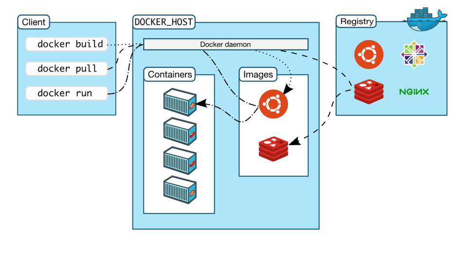

# Ubuntu安装
- 官网下载VMware并安装
  - 激活码 `https://webcache.googleusercontent.com/search?q=cache:wZSMi6VH_agJ:https://www.jijibeng.com/archives/147.html&cd=2&hl=zh-CN&ct=clnk&gl=jp`
- 官网下载Ubuntu 镜像文件
- 按操作步骤安装好Ubuntu

- 安装工具
  - `apt install git`
  - 安装docker `curl -fsSL https://get.docker.com | bash -s docker --mirror Aliyun`

## Ubuntu 安装docker遇到的问题
- 安装docker
- 安装docker-compose
- `docker images` permission denied
  - ``` sudo chmod 666 /var/run/docker.sock```

## docker
- docker
  - 
- docker命令大全
  - 
### 镜像
- 搜索镜像: `docker search centos`
- 下载镜像: 
  - `docker pull name[:tag]` 默认最新版本
- 查看镜像:
  - `docker images`
  - `docker image ls`
  - `docker inspect name:v1`
  - `docker history name:v1`
- 给镜像添加tag: `docker tag xxx:1 xxx/xxx:3`
- 删除镜像: -f 强制删除
  - `docker rmi name[:tag]`
  - `docker rmi imageId`
  - `docker image prune`
- 创建镜像:
  - `docker commit [options] container repository[:tag]` [options]  -a 作者 -m 备注信息 -p 提交时暂停容器运行
- 导出镜像: `docker save -o xxx.tag repository[:tag]`
- 导入镜像:
  - `docker load < xxx.tar`
  - `docker load -i xxx.tar`
- 上传镜像: `docker push name[:tag]`
- 拷贝文件: 
  - `docker cp /www/runoob 96f7f14e99ab:/www/` 本机 -> 容器
  - `docker cp  96f7f14e99ab:/www /tmp/` 容器 -> 本机

### 容器
- 查看容器
  - `docker ps –a`
  - `docker ps`
- 运行/创建容器:
  - `docker run -itd --name xxx name[:TAG]`
    - -i 让容器的标准输入保持打开 
    - -t 分配一个伪终端并绑定到容器上 
    - -d 守护态运行
    - --name 容器名称
- 创建容器:
  - `docker create` 创建容器，停止状态 
  - `docker start` 启动
  - `docker logs containerID` 查看容器输出信息
  - `ctrl+D或exit` 退出容器
  - `docker restart` 重新启动
- 终止容器：
  - `docker stop container`
  - `docker kill container` 不安全
- 进入容器: `docker exec -it containerID /bin/bash`
- 删除容器: `docker rm containerID/containerName`
- 导出容器: `docker export containerID > xxx.tar`
- 导入容器: 
  - `docker import xxx.tar repository[:tag]`
  - `docker import URL`
- 重启容器:
  - `docker restart`
  - `docker restart xxx`
- 其他: `docker run --help`
### 仓库
- dockerhub
  - 注册dockerhub账号
  - 创建仓库
  - 本地登录 `docker login `
  - 本地构建好镜像
  - `docker push`

### docker数据卷
- 特性:
  - 数据卷可以在容器之间共享和重用;
  - 对数据卷的修改会立刻生效;
  - 更新数据卷不会影响镜像;
  - 数据卷默认一直存在,即使容器被删除.
- 创建
  - `docker volume create xxx`
- 查看
  - `docker volume ls`
  - `docker volume inspect xxx`
- 挂载
  - `-v` 宿主机上没有指定文件不会报错，会自动创建指定文件
  - `--mount` 宿主机中没有这个文件会报错找不到指定文件，不会自动创建指定文件
- 删除
  - `docker volume rm xxx`
  - `docker volume prune`
- 数据卷容器
  - 创建 `docker run -d -v /dbdata --name dbdata training/postgres echo Data-only container for postgres`
  - 挂载 `--volumes-from`
    - `docker run -d --volumes-from dbdata --name db1 training/postgres`
- Docker 使用数据卷容器备份、恢复、迁移数据卷
  - 待补充
### Dockerfile
- Dockerfile中常用指令
  - FROM 指定基础镜像
  - RUN 执行命令
  - MAINTAINER 维护者
  - ADD 加载文件, 自动解压tar文件，可以下载网络资源
  - COPY 类似于ADD， 不会解压， 不可加载网络资源
  - CMD 用于指定在容器启动时所要执行的命令
  - ENTRYPOINT 用于指定在容器启动时所要执行的命令,对于CMD指令,执行`docker run`命令如果有传递参数,这些参数是可以覆盖 Dockerfile 中的CMD 指令参数,但是对于 ENTRYPOINT 来说，这些参数会被传递给 ENTRYPOINT，而不是覆盖。
  - LABEL 为镜像添加元数据
  - ENV 设置环境变量
  - EXPOSE 暴露端口
  - VOLUMN 指定挂载点,使容器内一个目录具有持久化能力
  - WORKDIR 指定工作目录
  - USER 指定当前用户
  - ARG 定义变量
  - ONBUILD 设置镜像触发器
  - HEALTHCHECK 健康检查
- 如何运行DockerFile
  - `docke build –f /path/Dockerfile –t imageName:tag .`
    - -f用来指定Dockerfile文件位置
    - -t指定构建成功后，镜像的仓库、标签等
    - . 指定上下文路径，也表示在当前目录下
- [Dockerfile](dockerfile.md)
### Docker Compose
- Compose用于自定义运行多容器Docker应用程序的工具,大多依赖于yml文件,默认使用当前目录下的“docker-compose.yml”,可以通过-f指定.
- docker-compose命令
  - `-f, --file FILE` 指定使用的 Compose 模板文件，默认为 docker-compose.yml，可以多次指定
  - `-p, --project-name NAME` 指定项目名称，默认将使用所在目录名称作为项目名
  - `docker-compose build` 构建（重新构建）项目中的服务容器。
  - `docker-compose config` 验证 Compose 文件格式是否正确，若正确则显示配置，若格式错误显示错误原因
  - `docker-compose down` 此命令将会停止 up 命令所启动的容器，并移除网络
  - `docker-compose exec` 进入指定的容器
  - `docker-compose help` 获得一个命令的帮助信息
  - `docker-compose images` 列出 Compose 文件中包含的镜像
  - `docker-compose kill` 通过发送 SIGKILL 信号来强制停止服务容器
  - `docker-compose logs` 查看服务容器的输出
  - `docker-compose pause` 暂停一个正在运行的服务容器
  - `docker-compose port` 打印某个容器端口所映射的公共端口
  - `docker-compose ps` 列出项目中目前的所有容器
  - `docker-compose pull` 拉取服务依赖的镜像
  - `docker-compose push` 推送服务依赖的镜像到 Docker 镜像仓库
  - `docker-compose restart` 重启项目中的服务
  - `docker-compose rm` 删除所有（停止状态的）服务容器。推荐先执行 `docker-compose stop` 命令来停止容器
  - `docker-compose run` 在指定服务上执行一个命令
  - `docker-compose scale` 设置指定服务运行的容器个数
  - `docker-compose start` 启动已经存在的服务容器
  - `docker-compose stop` 停止已经处于运行状态的容器，但不删除它。通过 `docker-compose start` 可以再次启动这些容器
  - `docker-compose top` 查看各个服务容器内运行的进程
  - `docker-compose unpause` 恢复处于暂停状态中的服务
  - `docker-compose up` 自动完成包括构建镜像，（重新）创建服务，启动服务，并关联服务相关容器的一系列操作
  - `docker-compose version` 打印版本信息
- `docker-compose.yml`编写
  - 文件配置
    - `.yml` or `.ymal`
  - 配置选项
    - `build`
      1. `build: /path/abc` or `build: ./abc`
      2. ```yaml
          build:
            context: ../
            dockerfile: path/abc
            args:
              - abc=1
              - password
         ```
      3. ```yaml
          build: ./abc
          image: webapp:tag
         ```
    - `context`
      - ```yaml
        build:
          context: ./abc
        ```
    - `dockerfile`
      - ```yaml 
        build:
          context: .
          dockerfile: Dockerfile-dev
        ```
    - `args`
      - ``` 
        ---dockerfile中指定参数---
        ARG abc
        ARG password
        RUN echo "abc: $abc"
        RUN echo "password: $password"
        ---docker-compose.yml---
        build:
          context: .
          args: 
            - abc=1
            - password=1
        ------------------
          args:
            abc:1
            password:1
        ------------------
          args:
            - abc
            - password
        ```
    - `cache_from`
      - ```yaml
        build: 
          context: .
          cache_from:
            - alpine:latest
            - corp/web_app:3.14
        ```
    - `labels`
      - ```yaml
        build:
          context: .
          labels:
            com.example.a: "webappa"
            com.example.b: "webappb"
            com.example.c: "webappc"
        ```
      - ```yaml
        build:
          context: .
          labels:
            - "com.example.a=webappa"
            - "com.example.b=webappb"
            - "com.example.c=webappc"
        ```
    - `shm_size`
      - ```yaml
        build:
          context: .
          shm_size: '4gb'
        ```
      - ```yaml
        build:
          context: .
          shm_size: 1000000
        ```
    - `target`
      - ```yaml
        build: 
          context: .
          target: prod
        ```
    - `cap_add` & `cap drop`
      - ```yaml
        cap_add:
          - ALL
        cap_drop:
          - NET_ADMIN
          - SYS_ADMIN
        ```
    - `command`
      - ```yaml
        command: bundle exec thin -p 3000
        ```
      - ```yaml
        command: ["bundle", "exec", "thin", "-p", "3000"]
        ```
    - `configs`
      - SHORT语法
        - ```yaml
          version: "3"
          services:
            redis:
              image: redis:latest
              deploy:
                replicas: 1
              configs:
                - my_config_1
                - my_config_2
          configs:
            my_config_1:
              file: ./my_config.txt
            my_config_2:
              external: true
          ```
      - LONG语法
        - ```yaml
          version: "3"
          services:
            redis:
              image: redis:latest
              deploy:
                replicas: 1
              configs:
                - source: my_config_1
                  target: /redis_config
                  uid: '103'
                  gid: '103'
                  mode: 0440
          configs:
            my_config_1:
              file: ./my_config.txt
            my_config_2:
              external: true
          ```
    - `cgroup_parent`
      - ```yaml
        cgroup_parent: m-executor-abc
        ```
    - `container_name`
      - ```yaml
        container_name: my_web_app
        ```
    - `credential_spec`
      - ```yaml
        credential_spec:
          file: my_credential_spec.json
        ```
      - ```yaml
        credential_spec:
          registry: my_credential_spec
        ```
    - `deploy`
      - ```yaml
          version: "3.3"
          services:
            redis:
              image: redis:latest
              deploy:
                replicas: 6
                update_config:
                  parallelism: 2
                  delay: 10s
                restart_policy:
                  condition: on-failure
                endpoint_mode: vip #指定连接到群组外部客户端服务发现方法
                labels: #指定服务的标签，这些标签仅在服务上设置
                  com.example.a: "webapp"
                mode: global # global:每个集节点只有一个容器, replicated:指定容器数量（默认）
                placement:
                  constraints:
                    - node.role == manager
                  preferences:
                    - spread: node.labels.zone
                resources:
                  limits:
                    cpus: '0.50'
                    memory: 50M
                  reservations:
                    cpus: '0.25'
                    memory: 20M
        ```
    - `devices`
      - ```yaml
        devices:
          - "/dev:/dev"
        ```
    - `depends_on`
      - ```yaml
        version: "3.3"
        services:
          web: 
            build: .
            depends_on: 
              - db
              - redis
          redis: 
            image: redis
          db: 
            image: postgres
        ```
    - `dns`
      - ```yaml
        dns: 
          - 8.8.8.8
          - 9.9.9.9
        ```
    - `dns_search`
      - ```yaml
        dns_search:
          - a.example.com
          - b.example.com
        ```
    - `tmpfs`
      - ```yaml
        tmpfs:
          - /run
          - /tmp
        ```
    - `entrypoint`
      - ```yaml
        entrypoint:
          - php
          - -d
          - zend_extension=/usr/local/lib/php/extensions/no_debug_non_zts/xdebug.so
          - -d
          - memory_limit=-1
          - verdor/bin/phpunit
        ```
    - `env_file`
      - ```yaml
        env_file:
          - ./common.env
          - ./apps/web.env
        ```
    - `environment`
      - ```yaml
        environment:
          RACK_ENV: development
          SHOW: 'true'
        ```
    - `expose`
      - ```yaml
        expose:
          - "3000"
          - "8000"
        ```
    - `external_links`
      - ```yaml
        external_links:
          - redis-1
          - project_db:mysql
        ```
    - `extra_hosts`
      - ```yaml
        extra_hosts:
          - "a:8.8.8.8"
          - "b:9.9.9.9"
        ```
    - `healthcheck`
      - ```yaml
        healthcheck:
          test: ["CMD", "curl", "-f", "http://localhost"]
          interval: 1m30s
          timeout: 10s
          retries: 3
          start_period: 40s
          disable: true
        ```
    - `image`
      - ```yaml
        image: redis:latest
        ```
    - `isolation`
    - `labels`
    - `links`
      - ```yaml
        links:
          - db
          - redis
          - db: database
        ```
    - `logging`
      - ```yaml
        logging:
          driver: syslog
          options:
            syslog-address: "tcp://127.0.0.1:9000"
        ```
    - `network_mode`
      - ```network_mode: "bridge"```
      - ```network_mode: "host"```
      - ```network_mode: "none"```
      - ```network_mode: "service:[service name]"```
      - ```network_mode: "container:[container name/id]"```
    - `networks`
      - ```yaml
        services:
          redis:
            networks:
              - some-network
              - other-network
        ```
    - `aliases`
      - ```yaml
        services:
          redis:
            some-network:
              aliases: 
                - alias1
                - alias2
        ```
    - ` ipv4_address, ipv6_address`
      - ```yaml
        version: '2.1'
        services:
          app:
            images: redis
            command: ifconfig
            networks:
              app_net:
                ipv4_address: 172.16.238.10
                ipv6_address: 2001:3984:3989::10
        networks:
          app_net:
            driver: bridge
            enable_ipv6: true
            ipam:
              driver: default
              config:
                  - subnet: 172.16.238.0/24
                  - subnet: 2001:3984:3989::/64
        ```
    - `PID`
      - `pid: "host"`
    - `ports'
      - ```yaml
        ports:
          - "3000"
          - "3000-3005"
          - "8000:8000"
          - "9090-9091:8080-8081"
          - "127.0.0.1:8001:8001"
          - "127.0.0.1:5000-5001:5000-5001"
          - "6060:6060/udp"
        ```
      - ```yaml
        ports:
          - target: 80
            published: 8080
            protocol: tcp
            mode: host
        ```
    - `secrets`
      - ```yaml
        version: "3.1"
        services:
          redis:
            image: redis:latest
            deploy:
              replicas: 1
            secrets:
              - my_secrets_1
              - my_secrets_2
        secrets:
          my_secrets_1: 
            file: ./my_secrets_1.txt
          my_secrets_2:
            external: true
        ```
      - ```yaml
        version: "3.1"
        services:
          redis:
            image: redis:latest
            deploy:
              replicas: 1
            secrets:
              - source: my_secrets_1
                target: redis_secret
                uid: '103'
                gid: '103'
                mode: 0440
        secrets:
          my_secrets_1: 
            file: ./my_secrets_1.txt
          my_secrets_2:
            external: true
        ```
    - `security_opt`
      - ```yaml
        security_opt:
          - label:user:USER
          - label:role:ROLE
        ```
    - `stop_grace_period`
      - `stop_grace_period: 1s`
      - `stop_grace_period: 1m30s`
    - `stop_signal`
      - `stop_signal: SIGUSR1`
    - `sysctls`
      - ```yaml
        sysctls:
          - net.core.somaxconn=1024
          - net.ipv4.tcp_syncookies=0
        ```
    - `ulimits`
    - `userns_mode`
    - `volumes`
      - 
      - 
    - `volumes_from`
      - 
    - 
    - `restart`
      - 
    - 
    - 