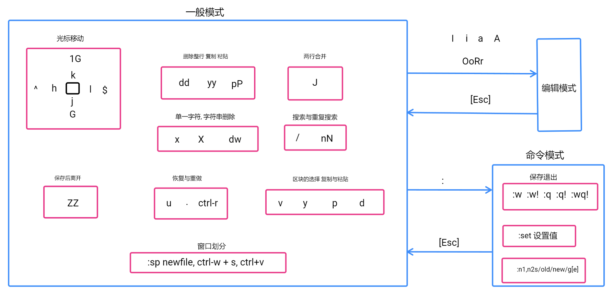
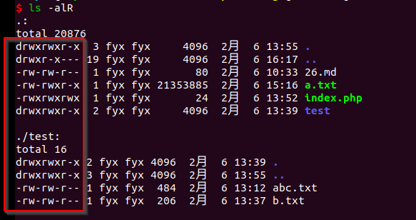

# Linux

### 命令

#### 文件目录相关

- `pwd` 查看当前path
- `ls [options]... [file]...` 显示当前目录内容
  - `-a` 显示隐藏文件,`-l` 列表, `-r` 逆序,`-R`递归
- `cd`
- `mkdir` 创建目录
  - `-p` 创建多级目录
- `touch` 创建文件
- `rm -rf `删除文件，目录
- `cp` copy目录，文件 `-r` 强制性
- `mv` 剪切目录，文件
- `cat -n a.txt | more` 只读查看文件，-n带行号，more显示分页，空格翻页
- `more a.txt`全屏按页显示，空格翻页，ctrl+b ↑，ctrl+f ↓
- `less a.txt` 适用于大文件
- `head -n a.txt` 查看前n行，默认10行
- `tail -n a.txt` 查看后n行， 默认10行
  - `tail -f a.txt` 实时监控文件变化
- `history ` 显示所有命令

#### 解压缩

- `tar`

  - `-c`: 建立压缩档案
  - `-x`：解压
  - `-t`：查看内容
  - `-r`：向压缩归档文件末尾追加文件
  - `-u`：更新原压缩包中的文件

  > 这五个是独立的命令，压缩解压都要用到其中一个，可以和别的命令连用但只能用其中一个。下面的参数是根据需要在压缩或解压档案时可选的。
  >

  - `-z`：有gzip属性的
  - `-j`：有bz2属性的
  - `-Z`：有compress属性的
  - `-v`：显示所有过程
  - `-O`：将文件解开到标准输出

  > 参数-f是必须的
  >

  - `-f`: 使用档案名字，这个参数是最后一个参数，后面只能接档案名。
- 总结

  1. *.tar 用 tar –xvf 解压
  2. *.gz 用 gzip -d或者gunzip 解压
  3. .tar.gz和.tgz 用 tar –xzf 解压
  4. *.bz2 用 bzip2 -d或者用bunzip2 解压
  5. *.tar.bz2用tar –xjf 解压
  6. *.Z 用 uncompress 解压
  7. *.tar.Z 用tar –xZf 解压
  8. *.rar 用 unrar e解压
  9. *.zip 用 unzip 解压
- `tar -zcvf abc.tar.gz /test` 压缩
- `tar -zxvf abc.tar.gz` 解压

#### vi & vim

- `vi xxx` or `vim xxx`
- 输入i/a, 退出ESC, : or /, :wq, :q, :q!
- `set nu`开启行号，`set nonu` 关闭行号
- `yy` or `5yy` 复制，从光标开始处
- `p` 粘贴
- `dd` or `5dd` 剪切、删除从光标开始处
- `x` 删除指定字符
- `u`/ `ctrl+r` 撤销动作/重做
- `:%s/old/new/g`  全文替换字符
- `:3,5s/old/new/g` 替换3-5行
- 切换全文首行[gg]，全文最末行[G]，调至具体某行[5gg]。
- 调至某行行首[^]，调至某行最后[$]
- 

#### 文件权限

- 

<table>
<tr>
<th colspan="4">第一列</th>
<th rowspan="2">第二列</th>
<th rowspan="2">第三列</th>
<th rowspan="2">第四列</th>
<th rowspan="2">第五列</th>
<th rowspan="2">第六列</th>
<th rowspan="2">第七列</th>
</tr>
<tr>
<td>第一列</td>
<td>第一组3个</td>
<td>第二组3个</td>
<td>第三组3个</td>
</tr>
<tr>
<td align="center">- 文件</td>
<td rowspan="5">所有者</td>
<td rowspan="5">所有者所在组</td>
<td rowspan="5">其他组用户</td>
<td rowspan="5">硬链接/子目录数</td>
<td rowspan="5" colspan="2">用户、组</td>
<td rowspan="5">文件大小，目录默认4096</td>
<td rowspan="5">最后修改时间</td>
<td rowspan="5">文件名</td>
</tr>
<tr>
<td align="center">d 目录</td>
</tr>
<tr>
<td align="center">l 软连接</td>
</tr>
<tr>
<td align="center">c 设备</td>
</tr>
<tr>
<td align="center">b 块文件</td>
</tr>
</table>

- r(Read，读取，权限值为4)：对文件而言，具有读取文件内容的权限；对目录来说，具有浏览目录的权限。
- w(Write,写入，权限值为2)：对文件而言，具有新增、修改文件内容的权限；对目录来说，具有删除、移动目录内文件的权限。
- x(eXecute，执行，权限值为1)：对文件而言，具有执行文件的权限；对目录了来说该用户具有进入目录的权限。
- 对于文件：r是读， w是写， x是执行
- 对于目录：x是进入目录， rx进入目录同时查看文件，wx可修改目录内的文件名
- 修改权限
  - `chmod [who] [+|–|=] [mode] 文件名`
  > who👀️
  - `u` 表示“用户（user）”，即文件或目录的所有者。
  - `g` 表示“同组（group）用户”，即与文件属主有相同组ID的所有用户。
  - `o` 表示“其他（others）用户”。
  - `a` 表示“所有（all）用户”。它是系统默认值。
  >操作符️👀️
  - `+` 添加某个权限。
  - `–` 取消某个权限。
  - `=` 赋予给定权限并取消其他所有权限（如果有的话）。
  > mode设置表示的权限可用下述字母的任意组合️👀
  - `r` 可读。
  - `w` 可写。
  - `x` 可执行。
  - `X` 只有目标文件对某些用户是可执行的或该目标文件是目录时才追加x 属性。
  - `s` 在文件执行时把进程的属主或组ID置为该文件的文件属主。方式“u＋s”设置文件的用户ID位，“g＋s”设置组ID位。
  - `t` 保存程序的文本到交换设备上。
  - `u` 与文件属主拥有一样的权限。
  - `g` 与和文件属主同组的用户拥有一样的权限。
  - `o` 与其他用户拥有一样的权限。
- 查看权限信息
  - `getfacl filename`
  - `setfacl -m u:user1:rw filename`
    - `-m`赋予， `-x`收回， `u`用户，`g`组

#### 网络
- `ifconfig`

#### 软件安装

#### 进程管理
- `ps -e, ps -ef, ps -eLf |more`查看进程
- `top, top -p pid`动态查看进程
- `nohup tail -f a.log &`后台运行程序，打印log到nohub.out
- `jobs `-> `fg 1` 从后台调到前台
- `systemctl start|stop|restart|reload|enable|disable 服务名称`
- `screen -ls` 正在运行的session
- `screen -r xxxx` session恢复

#### 内存使用率，磁盘使用率
- `free, free -m` 查看内存使用率 
- `top`
- `df -h` 查看使用情况
- `du -h xxx` 查看大小

#### 帮助命令
- `man top`
- `info top`

#### Shell
- `#! /bin/bash` 注释
- `chmod a+rw filename` 可执行权限
- `bash ./filename.sh` or `./filename.sh` 子线程中执行
- `source ./filename.sh` or `. filename.sh` 主线程中执行

#### 文件查找
- `stat` 查看文件状态
- `find` 查找
- `grep`
- `sed`
- `awk`

#### 防火墙

#### ssh
- sshd_config
  - prot:22
  - PermitRootLogin:yes
  - AuthorizedKeysFile.ssh/authorized_keys
- systemctl status|start|stop|restart|enable|disable sshd.service
- `ssh-keygen -t rsa`
- `ssh-copy-id`
- `ssh [-p ] user@ip`
- `scp` 上传文件
- 免密登录

#### crontab
- 一次性crontab
  - 安装at
  - `at 时间` eg: `at 15:15`
  - 输入内容
  - 退出保存
  - `atq`查看
- 周期crontab
  - `crontab -l` 查看
  - `crontab -e` 配置crontab
  - cron表达式`分 时 日 月 星期`
