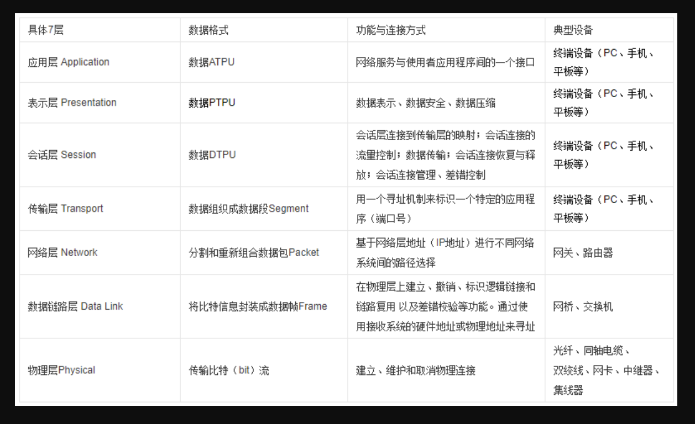

# OSI, TCP/IP Model
***
- 标准的七层模型，即OSI（Open System Interconnection）参考模型

---
>理解各种协议和通信层、套接字的含义
- IP：网络层协议；（高速公路）
- TCP和UDP：传输层协议；（卡车）
- HTTP：应用层协议；（货物）。HTTP(超文本传输协议)是建立在TCP协议之上的一种应用。HTTP连接最显著的特点是客户端发送的每次请求都需要服务器回送响应，在请求结束后，会主动释放连接。从建立连接到关闭连接的过程称为“一次连接”。
- SOCKET：套接字，TCP/IP网络的API。(港口码头/车站)Socket是应用层与TCP/IP协议族通信的中间软件抽象层，它是一组接口。socket是在应用层和传输层之间的一个抽象层，它把TCP/IP层复杂的操作抽象为几个简单的接口供应用层调用已实现进程在网络中通信。
- Websocket：同HTTP一样也是应用层的协议，但是它是一种双向通信协议，是建立在TCP之上的，解决了服务器与客户端全双工通信的问题，包含两部分:一部分是“握手”，一部分是“数据传输”。握手成功后，数据就直接从 TCP 通道传输，与 HTTP 无关了。

>*注:什么是单工、半双工、全工通信？
- 数据只能单向传送为单工；
- 数据能双向传送但不能同时双向传送称为半双工；
- 数据能够同时双向传送则称为全双工。

> TCP/UDP区别
- TCP（传输控制协议，Transmission Control Protocol）：(类似打电话)
- 面向连接、传输可靠（保证数据正确性）、有序（保证数据顺序）、传输大量数据（流模式）、速度慢、对系统资源的要求多，程序结构较复杂，
- 每一条TCP连接只能是点到点的，
- TCP首部开销20字节。
- UDP(用户数据报协议，User Data Protocol)：（类似发短信）
- 面向非连接 、传输不可靠（可能丢包）、无序、传输少量数据（数据报模式）、速度快，对系统资源的要求少，程序结构较简单 ，
- UDP支持一对一，一对多，多对一和多对多的交互通信，
- UDP的首部开销小，只有8个字节。
