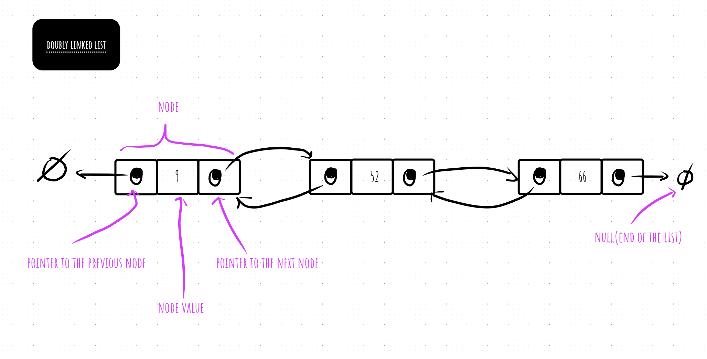

## doubly-linked-list

- [go container/list doubly linked list 参考文档](https://pkg.go.dev/container/list@go1.19.3)

- 双向链表的每个元素都是一个对象, 每个对象有一个关键字`key`和两个指针:`next`和`prev`, 对象中还可以包含其他的辅助数据(卫星数据).

- linked data structure that consist of a set of sequentially linked records called nodes
- each node contains two fields, called links, that are references to the previous and to the next node in the sequence of nodes.

