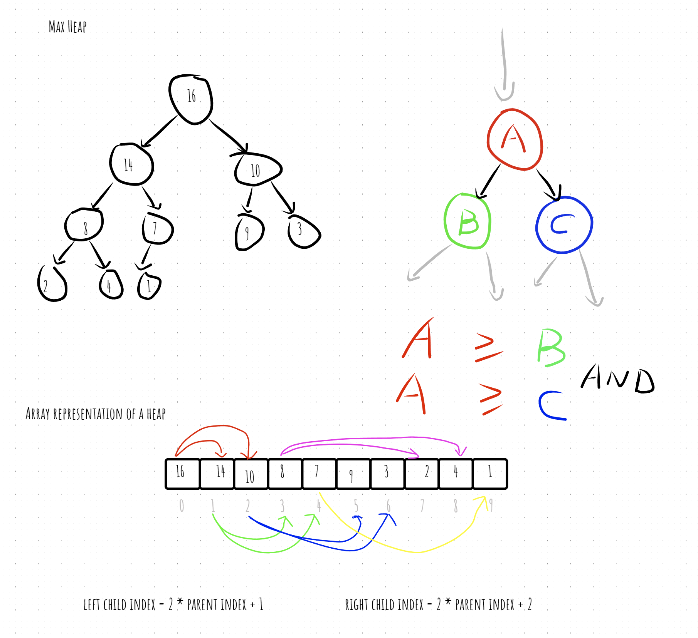

# heap

- [go container/heap 参考文档](https://pkg.go.dev/container/heap@go1.19.3)
- 堆排序
- (二叉)堆是一个数组, 它可以被看成一个近似的完全二叉树, 树上的每个节点对应数组中的一个元素.
- 树的根节点是A[1], 给定一个节点的下标i, 计算父节点, 左节点, 右节点的下标 
  - PARENT(i) [i/2]
  - LEFT(i) [2i]
  - RIGHT(i) [2i+1]
  
- 最大堆
  - 除根节点外: A[PARENT(i)] >= A[i];
- 最小堆
  - 除根节点外: A[PARENT(i)] <= A[i];

- [code](heap.go)