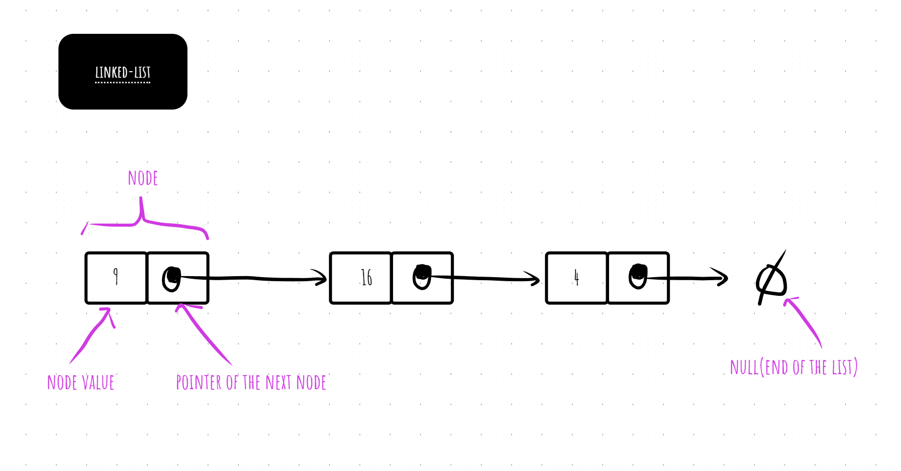

### linked-list

- 链表是一种这样的数据结构, 其中的各对象按照线性顺序排列. 数组的线性顺序是由数组的下标决定的,然而与数组不同的是,链表的顺序是由各个对象里的指针决定的.
- 

- linear collection of data elements, in which linear order is not given by their physical placement in memory.
- instead, each element points to the next. it is a data structure consisting of a group of nodes that together represent a sequence.

- 双向链表
  - [go container/list doubly linked list 参考文档](https://pkg.go.dev/container/list@go1.19.3)
  
- [code](linked-list.go)