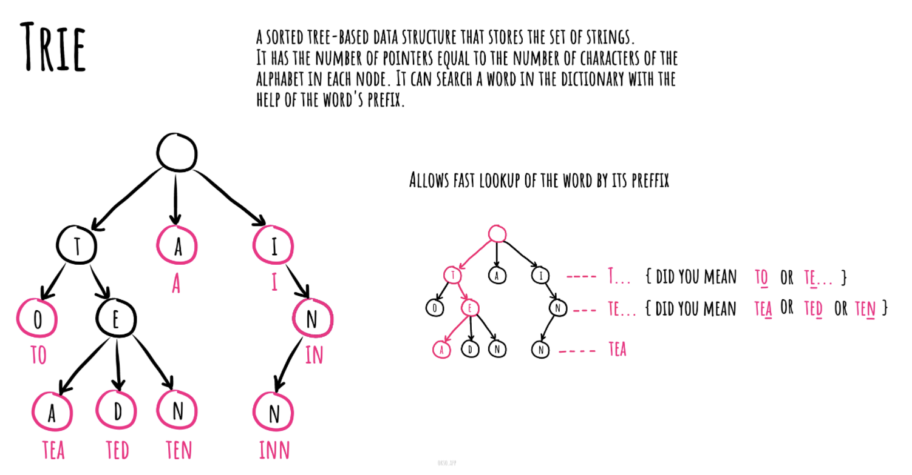

# trie

- 在计算机科学中, 字典树(trie,中文又被称为”单词查找树“或 ”键树“), 也称为数字树,有时候也被称为基数树或前缀树（因为它们可以通过前缀搜索）,它是一种搜索树--一种已排序的数据结构,通常用于存储动态集或键为字符串的关联数组。

- 与二叉搜索树不同, 树上没有节点存储与该节点关联的键; 相反,节点在树上的位置定义了与之关联的键。一个节点的全部后代节点都有一个与该节点关联的通用的字符串前缀, 与根节点关联的是空字符串。

- 值对于字典树中关联的节点来说,不是必需的,相反,值往往和相关的叶子相关,以及与一些键相关的内部节点相关。

- 算法步骤:
  - 根节点/ 什么都不表示
  - 做一个字典比如a-z 字母表
  - 没一个节点包含这26个字母的字典表，每个位置保存下个节点的指针。

- 缺点：
  - trie树比较消耗内存：因为他没一层都保存一个字典表，就算这层的节点只有一个也要有一组表
  - 使用的是指针类型，内存不连续对存储不友好，性能打折扣
- 优点：
  - 查询效率比较高，对于一些范围较小的或者内存不敏感的应用可以使用
  - 特别适用自动补全类应用
  