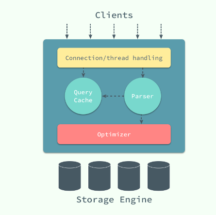
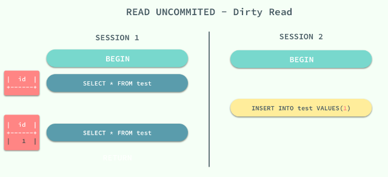
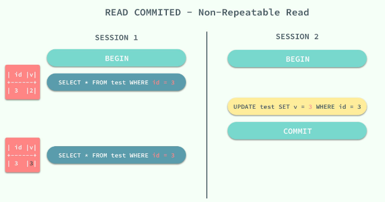
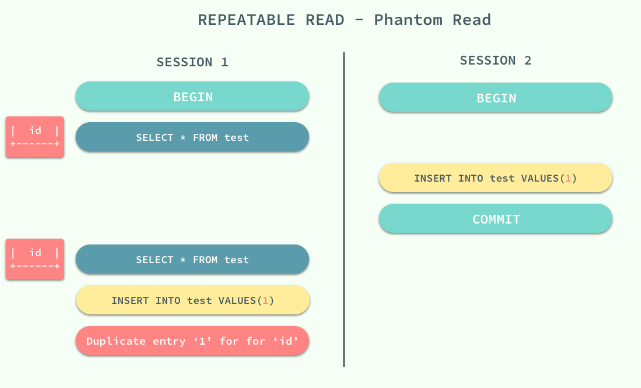

## MYSQL.InnoDB

### MySQL 的架构

- 最上层用于连接、线程处理的部分并不是 MySQL 『发明』的，很多服务都有类似的组成部分
- 第二层(server)中包含了大多数 MySQL 的核心服务，包括了对 SQL 的解析、分析、优化和缓存等功能，存储过程、触发器和视图都是在这里实现的
- 第三层(存储引擎)就是 MySQL 中真正负责数据的存储和提取的存储引擎
---
### 数据的存储
- 在 InnoDB 存储引擎中，所有的数据都被逻辑地存放在表空间中，表空间（tablespace）是存储引擎中最高的存储逻辑单位，在表空间的下面又包括段（segment）、区（extent）、页（page）
---
### 如何存储表
- MySQL 使用 InnoDB 存储表时，会将表的`定义`和`数据索引`等信息分开存储，其中前者存储在 .frm 文件中，后者存储在 .ibd 文件中
---
### 如何存储记录
- InnoDB 使用页作为磁盘管理的最小单位；数据在 InnoDB 存储引擎中都是按行存储的，每个 16KB 大小的页中可以存放 2-200 行的记录
--- 
### 数据页结构
- 页是 InnoDB 存储引擎管理数据的最小磁盘单位，而 B-Tree 节点就是实际存放表中数据的页面
---
### 索引
- 它是存储引擎能够快速定位记录的秘密武器，对于提升数据库的性能、减轻数据库服务器的负担有着非常重要的作用；
- 索引优化是对查询性能优化的最有效手段
- 聚集索引和辅助索引
  - 数据库中的 B+ 树索引可以分为聚集索引（clustered index）和辅助索引（secondary index），它们之间的最大区别就是，聚集索引中存放着一条行记录的全部信息，而辅助索引中只包含索引列和一个用于查找对应行记录的『书签』。
  - 聚集索引与表的物理存储方式有着非常密切的关系，所有正常的表应该有且仅有一个聚集索引（绝大多数情况下都是主键），表中的所有行记录数据都是按照聚集索引的顺序存放的。
  - 数据库将所有的非聚集索引都划分为辅助索引
---
### 锁
- InnoDB 存储引擎中使用的就是悲观锁，而按照锁的粒度划分，也可以分成行锁和表锁。
#### 并发控制机制
- 悲观并发控制、乐观并发控制和多版本并发控制
- 乐观锁和悲观锁其实都是并发控制的机制，同时它们在原理上就有着本质的差别
  - 乐观锁是一种思想，它其实并不是一种真正的『锁』，它会先尝试对资源进行修改，在写回时判断资源是否进行了改变，如果没有发生改变就会写回，否则就会进行重试，在整个的执行过程中其实都**没有对数据库进行加锁**
  - 悲观锁就是一种真正的锁了，它会在获取资源前对资源进行加锁，确保同一时刻只有有限的线程能够访问该资源，其他想要尝试获取资源的操作都会进入等待状态，直到该线程完成了对资源的操作并且释放了锁后，其他线程才能重新操作资源
- 多版本并发控制
#### 锁的种类
- 共享锁（读锁）：允许事务对一条行数据进行读取
- 互斥锁（写锁）：允许事务对一条行数据进行删除或更新
#### 锁的粒度
- 意向共享锁：事务想要在获得表中某些记录的共享锁，需要在表上先加意向共享锁；
- 意向互斥锁：事务想要在获得表中某些记录的互斥锁，需要在表上先加意向互斥锁；
#### 锁的算法
- 记录锁（Record Lock）是加到索引记录上的锁
- 间隙锁（Gap Lock）是对索引记录中的一段连续区域的锁
  - 间隙锁是存储引擎对于性能和并发做出的权衡，并且只用于某些事务隔离级别
- Next-Key是记录锁和记录前的间隙锁的结合
  - Next-Key 锁锁定的是当前值和前面的范围
  - Next-Key 锁的作用其实是为了解决幻读的问题
#### 死锁的发生
-  InnoDB 中实现的锁是悲观的，那么不同事务之间就可能会互相等待对方释放锁造成死锁，最终导致事务发生错误
---
### 事务与隔离级别
- RAED UNCOMMITED：使用查询语句不会加锁，可能会读到未提交的行（Dirty Read）
- READ COMMITED：只对记录加记录锁，而不会在记录之间加间隙锁，所以允许新的记录插入到被锁定记录的附近，所以再多次使用查询语句时，可能得到不同的结果（Non-Repeatable Read）
- REPEATABLE READ：多次读取同一范围的数据会返回第一次查询的快照，不会返回不同的数据行，但是可能发生幻读（Phantom Read）
- SERIALIZABLE：InnoDB 隐式地将全部的查询语句加上共享锁，解决了幻读的问题
- MySQL 中默认的事务隔离级别就是 REPEATABLE READ，但是它通过 Next-Key 锁也能够在某种程度上解决幻读的问题
#### 脏读
- 在一个事务中，读取了其他事务未提交的数据
- 

#### 不可重复读
- 在一个事务中，同一行记录被访问了两次却得到了不同的结果
- 
- 不可重复读的原因就是，在 READ COMMITED 的隔离级别下，存储引擎不会在查询记录时添加行锁

#### 幻读
- 在一个事务中，同一个范围内的记录被读取时，其他事务向这个范围添加了新的记录。
- 
- 在标准的事务隔离级别中，幻读是由更高的隔离级别 SERIALIZABLE 解决的，但是它也可以通过 MySQL 提供的 Next-Key 锁解决