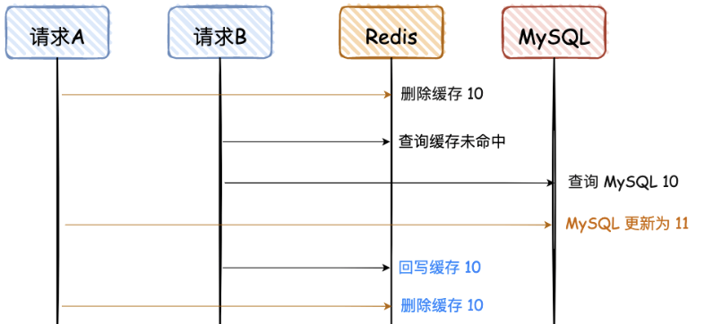

# 如何保障 MySQL 和 Redis 的数据一致性
> #### 在满足实时性的条件下，不存在两者完全保存一致的方案，只有最终一致性方案
---
>  bad
### 先写MySQL，再写Redis

- 请求 A、B 都是先写 MySQL，然后再写 Redis，在高并发情况下，如果请求 A 在写 Redis 时卡了一会，请求 B 已经依次完成数据的更新，就会出现图中的问题

### 先写Redis，再写MySQL

- 同上

### 先删Redis，再写MySQL

- 请求 A 先删除缓存，可能因为卡顿，数据一直没有更新到 MySQL，导致两者数据不一致。
- 这种情况出现的概率比较大，因为请求 A 更新 MySQL 可能耗时会比较长，而请求 B 的前两步都是查询，会非常快。

--- 
>  good
### 先删Redis，再写MySQL，再删Redis

- 让请求 A 的最后一次删除，等待 500ms

- 重试机制，可以借助消息队列的重试机制，也可以自己整个表，记录重试次数
- “缓存双删” 不要用无脑的 sleep 500 ms
- 通过消息队列的异步 & 串行，实现最后一次缓存删除；
- 缓存删除失败，增加重试机制。

### 先写MySQL，再删Redis

- 对于不是强一致性要求的业务，可以容忍

- 缓存刚好自动失效；
- 请求 B 从数据库查出 10，回写缓存的耗时，比请求 A 写数据库，并且删除缓存的还长。

### 先写MySQL，通过Binlog，异步更新Redis

- 监听 MySQL 的 Binlog，然后通过异步的方式，将数据更新到 Redis，这种方案有个前提，查询的请求，不会回写 Redis。
- 这个方案是实现最终一致性的终极解决方案，但是不能保证实时性

--- 
### 几种方案比较
1. 先写 Redis，再写 MySQL
   - 这种方案，万一 DB 挂了，把数据写到缓存，DB 无数据，这个是灾难性的；
   - 如果写 DB 失败，对 Redis 进行逆操作，那如果逆操作失败呢，是不是还要搞个重试？
2. 先写 MySQL，再写 Redis
   - 对于并发量、一致性要求不高的项目，很多就是这么用的，但是不建议这么做；
   - 当 Redis 瞬间不可用的情况，需要报警出来，然后线下处理。
3. 先删除 Redis，再写 MySQL
   - 这种方式，直接忽略吧。
4. 先删除 Redis，再写 MySQL，再删除 Redis
   - 这种方式虽然可行，但是感觉好复杂，还要搞个消息队列去异步删除 Redis。
5. 先写 MySQL，再删除 Redis
   - 比较推荐这种方式，删除 Redis 如果失败，可以再多重试几次，否则报警出来；
   - 这个方案，是实时性中最好的方案，在一些高并发场景中，推荐这种。
6. 先写 MySQL，通过 Binlog，异步更新 Redis
   - 对于异地容灾、数据汇总等，建议会用这种方式，比如 binlog + kafka，数据的一致性也可以达到秒级；
   - 纯粹的高并发场景，不建议用这种方案，比如抢购、秒杀等。

--- 
### 总结
- 实时一致性方案：采用 “先写 MySQL，再删除 Redis” 的策略，这种情况虽然也会存在两者不一致，但是需要满足的条件有点苛刻，所以是满足实时性条件下，能尽量满足一致性的最优解。
- 最终一致性方案：采用 “先写 MySQL，通过 Binlog，异步更新 Redis”，可以通过 Binlog，结合消息队列异步更新 Redis，是最终一致性的最优解。
