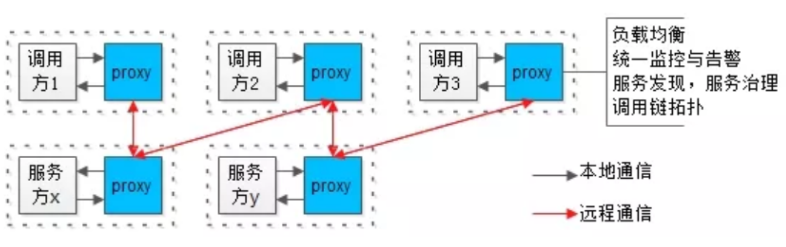
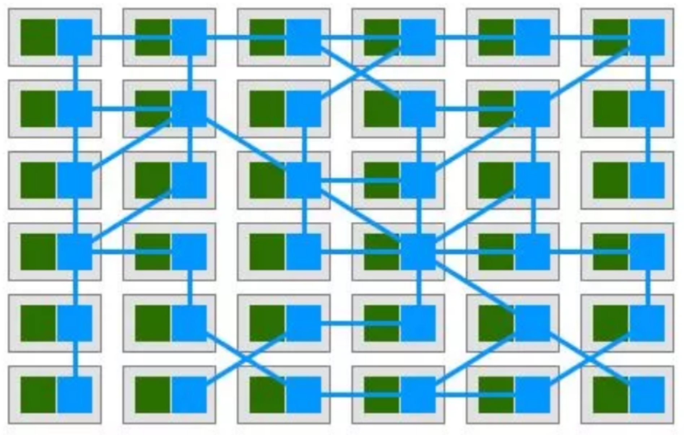
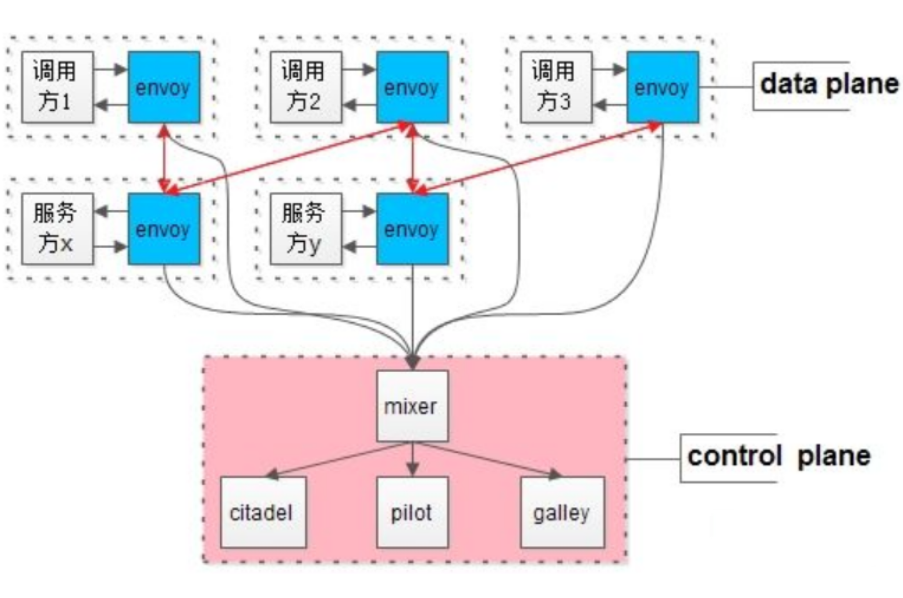

# 架构

### 技术选型

1. 初期架构方案选择
   - 快速实现
   - [ALL in one架构](qa_1.md#n0)
   - 技术栈二选一PHP, JAVA
   - 这个阶段研发主要在写CURD业务逻辑，引入DAO和ORM能极大提高工程效率

2. 使用开源框架组件还是自研
    - 早期不建议自研
    - 随着规模的扩大，要控制技术栈
    - [要浅浅的封装一层]()
    - 适当的时候，造一些契合业务的轮子
    
3. 容量评估
    - 新系统上线
    - 临时运营活动
    - 系统容量有质变性增长
    - [容量设计五大步骤]()

4. 系统层面, 评估哪些指标
    - 网络带宽、CPU、内存容量、磁盘容量、磁盘IO等资源指标
    - 系统层面主要看吞吐量指标

5. 初期,系统存在瓶颈时优化原则
    - 最低成本，初期最大的成本是时间成本
    - 用“钱”和“资源”快速解决系统问题，而不是过早的系统重构
    - 将ALL in one架构升级为[伪分布式架构](qa_1.md#n1)，是此阶段的最佳实践

6. 伪分布式
- 伪分布式的本质是单机变多机，但又不是真正的高可用，其核心是垂直拆分
  - 业务垂直拆分
  - 代码垂直拆分
  - 数据库垂直拆分
  - 研发团队垂直拆分
  - [伪分布式的优化细节]()

### 接入层架构

7. 接入层扩展
    - 反向代理
   
8. 常见的反向代理
    - Nginx
   
9. 引入反向代理要解决什么问题
   - 集群负载均衡([常见的负载均衡方法]())
   - [反向代理高可用]()
   
10. 接入层架构演进
    - 有反向代理技术之前，单体架构要解决扩展性问题，可使用[DNS轮询架构]()
    - 有[反向代理]()技术之后，初期可以使用反向代理解决扩展性问题
    - 升级为[高可用反向代理架构]()
    - [多级反向代理]()，引入LVS&F5进一步扩充性能
    - 无限性能，必须用[DNS轮询架构]()
    
11. Session一致性问题
    - [客户端层解决]()
    - [反向代理层解决]()
    - [web-server层解决]()
    - [后端服务层解决]()
    
12. CDN架构
    - 什么样的资源适合静态加速
    - CDN的架构是怎么样的
    - CDN是怎么实现“就近访问的”
    - 如何保证源站和镜像站数据的一致性
    - 资源更新，是推还是拉
    - 斯塔尔报告
    
13. TCP接入需要考虑的问题
    - TCP如何快速实现接入
    - TCP如何快速实现扩展，以及高可用
    - TCP如何快速实现负载均衡
    - TCP如何保证扩展性与耦合性的平衡
    - [综合方案，系统性解决负载均衡 + 高可用 + 可扩展 + 解耦合等一系列问题]()

### 性能优化

14. 早期常用的架构
    - ALL in one架构
15. 系统优化方向
    - 用最短时间，以对代码最小的冲击，极速扩充系统性能
16. 扩充系统性能
    - [三大分离]()的性能优化方法
17. 提升用户体验
    - [动静分离]()
18. 动静分离
- 动静分离，是“静态页面与动态页面，分开不同的系统访问”的架构设计方法
  - [如何实施]()
19. 页面静态化技术
- 将“原本需要动态生成的页面，提前生成静态页面”
  - [“页面静态化”]()技术，能够100倍提升访问速度
  - [适用场景]()
20. 早期系统瓶颈在哪
    - 数据库读性能
21. 提升数据库读性能
    - 读写分离，使用数据库分组架构，一主多从，主从同步，读写分离
    - [读写分离，水平切分都是使用数据库集群，有什么异同]()
22. 解决复杂SQL对数据库的影响
    - 前台与后台分离
    - [前后端分离，前台后台分离，是一回事么？如何快速实施前台与后台分离]()

### 微服务架构

23. 流行的技术栈
    - PHP语言的[LAMP]()栈
    - Java语言的[LiToMyJa]()栈
24. 业务快速发展,三层架构存在的问题
    - 代码频繁拷贝
    - 底层复杂性扩散
    - 公共库耦合
    - SQL质量不可控，数据库性能急剧下降
    - 数据库耦合，无法实现增加实例扩容
    
25. 解决三层架构可能出现的问题
    - [微服务架构]()解决以上问题
26. 微服务落地, 服务粒度选择
    - 统一服务层
    - 按业务划分服务
    - 按库划分服务
    - 按接口划分服务（需要轻量级进程等语言层面支持）
27. 微服务架构,可能遇到的问题
    - 系统复杂性上升
    - 层次间依赖关系变得复杂
    - 运维，部署更麻烦
    - 监控变得更复杂
    - 定位问题更麻烦
28. 微服务架构要解决什么问题
    - [高可用]()
    - [无限性能扩展]()
    - [负载均衡]()
29. 解决高可用问题
    - [虚IP]()
    - [反向代理]()
    - [集群]()
    - [连接池]()
    - [数据库分组]()
    - [缓存冗余]()
    - [故障转移]()
    - [高可用的方法论]()
30. 解决无限性能扩展问题
    - [Scale up]()
    - [Scale out]()
    - [DNS轮询]()
    - [反向代理]()
    - [连接池]()
    - [水平切分]()
    - [无限性能的方法论]()
31. 解决负载均衡问题
    - 同构均匀分摊
    - 异构按能力分摊
      - 静态权重法
      - 动态权重法，涉及[“保险丝”]()算法
        - 动态权重法还可以实现服务器的[过载保护]()
32. 和高可用, 无限性能扩展,负载均衡相关的组件
    - [连接池]()
33. 连接池
    - 两个核心数据结构：连接数组，锁数据
    - 三个核心接口：初始化，拿出连接，放回连接
    - [连接池内核]()
### 数据库架构

34. 工程上数据库设计
    - 根据“业务模式”设计[表结构]()
    - 根据“访问模式”设计[索引结构]()
35. 架构上数据库要考虑哪些
    - 读性能提升
    - 高可用
    - 一致性保障
    - 扩展性
    - 垂直拆分
36. 数据库读取速度提升
    - 建立索引
    - 增加从库
    - 增加缓存
37. 数据库分组集群, 主从同步, 读写分离,主库和从库创建不同索引
    - 主库只响应写请求，不建立索引
    - 线上从库，建立线上访问索引
    - 后台从库，建立后台访问索引
38. 数据库高可用
- 冗余+故障自动转移
  - 写库高可用，冗余写库
  - 读库高可用，冗余读库
39. 数据冗余带来的副作用
    - 两个写库数据可能不一致
    - 主库和从库数据可能不一致
40. 写库高可用,两个写库数据同步,自增ID方案
    - 为每个写库指定不同的初始值，相同的增长步长
    - 生成不同的ID
    - 一个写库提供服务，一个写库作为高可用影子主
41. 主从延时优化
    - 业务容忍
    - 强制读主
    - 在从库有可能读到旧数据时，[选择性读主]()
42. 底层表结构变更，水平扩展分库个数发生变化，底层存储引擎升级，数据库如何平滑过度
    - 如果业务能够接受，可以停服扩展
    - [追日志平滑扩容法]()，平滑过度
    - [双写平滑扩容法]()，平滑过度
    - [秒级平滑扩容法]()
    - [如何在秒级，实现读写实例加倍？容量加倍]()
43. 数据库垂直拆分的最佳实践
    - 数据库垂直拆分，尽量把：
      （1）长度短；
      （2）访问频率高；
      （3）经常一起访问；
      的数据放在主表里。

### 缓存架构

44. 工程上，缓存一般有几种使用方式
    - [进程内缓存]()
    - 进程外缓存，也就是[缓存服务]()
45. 多个服务使用进程内缓存，如何保证一致性
    - 服务节点同步通知
    - MQ异步通知
    - 牺牲少量一致性，定期后端更新
46. 使用缓存服务，缓存的使用的注意点
    - 服务与服务之间不要通过缓存传递数据
    - 如果缓存挂掉，可能导致雪崩，此时要做高可用缓存，或者水平切分
    - 调用方不宜再单独使用缓存存储服务底层的数据，容易出现数据不一致，以及反向依赖
    - 不同服务，缓存实例要做垂直拆分，不宜共用缓存
47. 缓存操作细节，最佳实践
    - [Cache Aside Pattern]()
48. Cache Aside Pattern
- 它分为读缓存最佳实践，以及写缓存最佳实践
  - 读缓存最佳实践
    - 先读缓存，命中则返回；未命中则读数据库，然后设置缓存
  - 写缓存最佳实践
    - 淘汰缓存，而不是修改缓存
    - 先操作数据库，再操作缓存
49. 缓存的本质是“冗余了数据库中的数据”,可能存在什么问题
    - 缓存与数据库[数据不一致]()
50. 什么场景下容易出现不一致
    - 写[后立即读]()业务场景
51. 出现不一致时，优化思路
    - 及时把缓存中的脏数据淘汰掉
52. 具体要怎么淘汰，保证缓存与数据库中数据的一致性
    - 服务同步二次淘汰法
    - 服务异步二次淘汰法
    - 线下异步二次淘汰法
    - [二次淘汰法，是很常见的一种实践]()
53. 最常用的缓存服务
    - Redis和memcache
54. 什么时候选择使用Redis
    - 需要支持复杂数据结构
    - 需要支持持久化
    - 需要天然高可用
    - value存储内容比较大
    - 如果只是[纯KV，可以使用memcache]()

### 解耦

55. 依赖（调用）某个下游服务集群，将下游集群信息放在自身配置文件里是一种惯用做法，该做法可能导致什么问题
    - 架构设计中典型的反向依赖
        - 上游痛：扩容的是下游，改配置重启的是上游
        - 下游痛：不知道谁依赖于自己，难以实施服务治理，按调用方限流
56. 常见的配置架构演进
    - “配置私藏”架构；
    - “全局配置文件”架构
    - “配置中心”架构
    - 除了配置中心，消息总线MQ也是互联网架构中的常见解耦利器
57. 什么时候不使用MQ
    - 上游实时关注执行结果时，通常不使用MQ，而使用RPC调用
58. 什么时候使用MQ来解耦
    - 数据驱动的任务依赖
    - 上游不关心执行结果
    - 上游关注结果，但执行时间很长，例如跨公网调用第三方服务
    - 削峰填谷，流量控制，保护下游
59. 上下游IP耦合,如何解耦
    - 使用内网域名来代替内网IP
60. 多个模块,公共库而耦合在一起, 如何解耦
    - 粗暴方案：代码各自拷贝一份
    - 垂直拆分，个性业务代码“上浮”
    - 服务化，共性业务代码“下沉”
61. 多个模块,数据库而耦合在一起, 如何解耦
    - [数据库耦合，当数据库成为瓶颈时，增加数据库实例也难以拆分扩容]()
       - 第一步，公共数据访问服务化，数据私藏
       - 第二步，个性数据访问，自己家的数据自己管理
62. 微服务拆分不完全,导致耦合, 如何解耦
    - 架构复杂时，微服务是好事，但拆分不彻底反而会有坑
      - 底层微服务功能要尽量通用
      - 杜绝底层switch case不同业务类型的业务逻辑代码
      - 个性化代码上浮，公共代码下沉，是更古不变的架构解耦准则

### 分层架构
- [架构分层，对研发效率的提升，与复杂性的屏蔽，至关重要]()

63. 系统架构分层会越来越多的原因
    - 让上游更高效的获取与处理数据，必须复用
    - 让下游能屏蔽数据的获取细节，必须封装
64. 每次都要连接数据库获取数据,编码非常低效,有什么痛点
    - 创建连接，创建资源
    - 拼装SQL
    - 执行SQL并获取结果集
    - 通过游标遍历结果集，拿到每一行，分析行数据，拿到每一列
    - 关闭连接，回收资源
65. 优化64
    - 分层抽象, 分离DAO层
66. 单体架构,编码非常低效,有什么痛点
    - 关注缓存细节（Redis？MC？）
    - 关注存储引擎细节（MySQL？）
    - 关注分库分表
    - 关注数据路由规则
67. 优化66
    - 分层抽象，分离基础服务层（微服务）
68. 微服务架构,编码非常低效,有什么痛点
    - 要访问很多RPC接口，获取很多公共的数据
    - 站点层与基础服务层之间的连接关系非常复杂
    - 不同垂直业务之间有需要共性业务，代码要冗余很多次
69. 优化68
    - 分层抽象，分离共性业务服务层
    - [中台业务服务]()
70. PC/H5/APP多端业务,编码非常低效,有什么痛点
    - 大部分业务逻辑相同，只有少量展现/交互不一样
    - 一旦一个服务RPC接口升级，多端都要升级
    - 一旦一个服务bug出现，多端都要升级
    - PC/H5/APP多端相同的逻辑存在大量代码拷贝
71. 优化70
    - 分层抽象，前后端分离
72. 大数据量,高并发量的微服务架构,编码非常低效,有什么痛点
    - 根据业务进行数据路由，水平切分
    - 不确定路由的接口，要遍历全库
    - 有时候要多个库拿数据，然后到内存排序，例如跨库分页需求
73. 优化72
    - 分层抽象，数据库中间件

### 架构进阶

74. 负载均衡、数据收集、服务发现、调用链跟踪。这些非业务的功能,一般是谁实现的呢
    - 互联网公司一般会有一个“架构部”，研发框架、组件、工具与技术平台
    - 业务研发部门直接使用相关框架、组件、工具与技术平台，享受各种“黑科技”带来的便利
75. 对于74中“黑科技”的使用与推广,存在什么问题
    - 业务研发团队，需要花大量时间去学习、使用基础框架与各类工具
    - 架构部，对于“黑科技”不同语言客户端的支持，往往要开发C-client，Python-client，go-client，Java-client多语言版本
    - 架构部，“黑科技” client要维护m个版本， server要维护n个版本，兼容性要测试m*n个版本
    - 每次“黑科技”的升级，都需要推动上下游进行升级，这个周期往往是以季度、半年、又甚至更久，整体效率极低
    - [每次fastjson漏洞升级]()
76. 如何优化
    - 解耦，将业务服务拆分成两个进程
    
      - 一个进程实现业务逻辑（不管是调用方，还是服务提供方），biz，即上图白色方块
      - 一个进程实现底层技术体系，proxy，即上图蓝色方块
        - 负载均衡、监控告警、服务发现与治理、调用链…等诸多基础设施，都放到这一层实现
    - 特点
      - biz和proxy共同诞生，共同消亡，互为本地部署，即上图虚线方框
      - biz和proxy之间，为本地通讯，即上图黑色箭头
      - 所有biz之间的通讯，都通过proxy之间完成，proxy之间才存在远端连接，即上图红色箭头
    - Service Mesh服务网格
    - 业务的归业务，技术的归技术
    - 
      - 绿色为biz
      - 蓝色为proxy
77. Service Mesh的行业开源最佳实践
    - [Istio]()
78. Istio的架构核心
    - 数据平面(data plane)
    - 控制平面(control plane)
    - 
    - [控制与实施分离]()
    - [envoy，mixer，citadel，pilot和galley的职责与细节]()
79. 单机房架构的特点
    - 架构分层之间，是[全连接]()
80. 理想化的多机房架构
    - 架构分层之间，是[同连接]()，即：站点，服务，数据全部[单元化]()，仅连接同机房
81. 理想化的多机房架构,存在什么问题
    - 并非所有的业务都能“单元化”
    - 如果不能“单元化”，跨机房的数据同步存在较大延时
82. 折衷方案
    - 可以实施[“折衷多机房架构”]()
83. 什么是“折衷多机房架构”?
    - 站点，服务，数据做不到全量单元化，做不到“只”连接同机房，但可以[“最小化”跨机房连接]()，整个架构，可以只有两个地方跨机房
      - 数据库写库（相比读，写的比例较小）
      - 数据库一处主从同步（本来就有延时）
84. 折衷多机房架构，有什么优点
    - 机房区分主次，落地性强，对原有架构冲击较小，[业务几乎不需要进行单元化改造]()
    - [多机房架构细节]()
