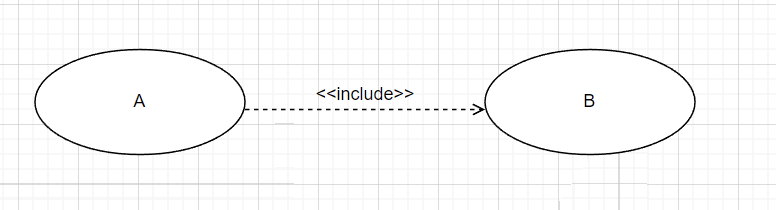
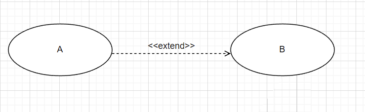
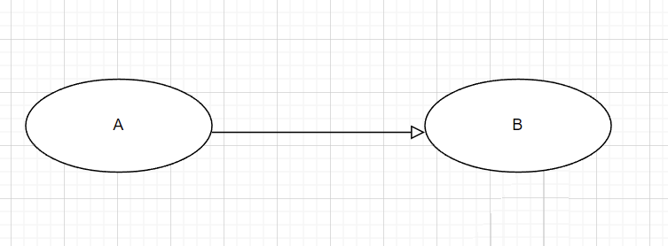
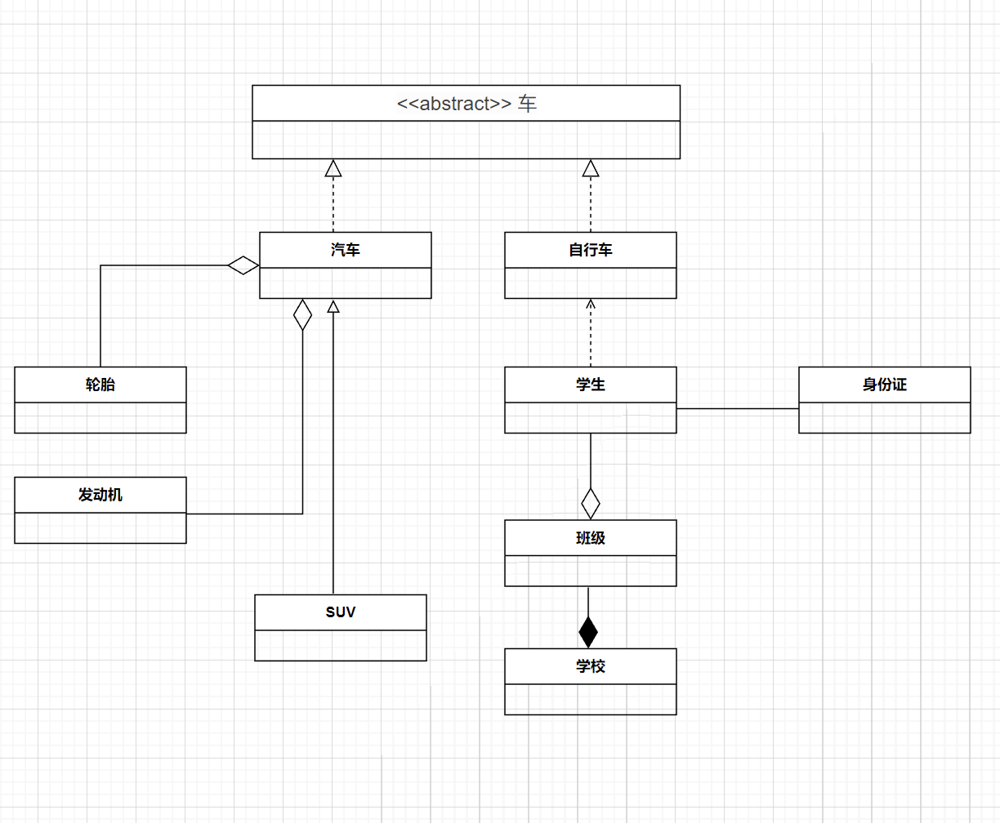
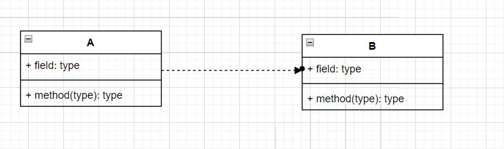
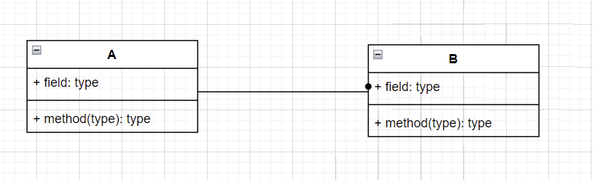
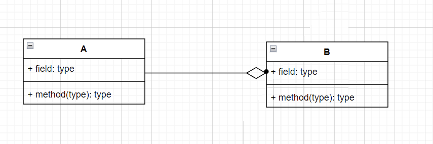
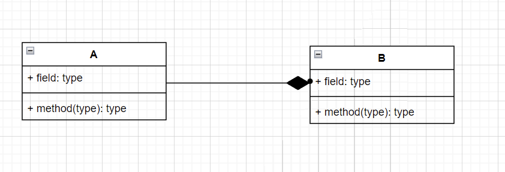
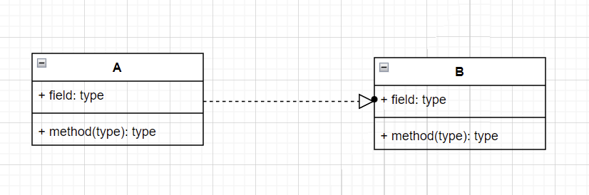

### OOA-UML图

#### 数据流图(DFD)

#### 程序流程图,盒图 

#### 静态图(结构图)
- 类图
  - 一组类,接口,写作和它们之间的关系
- 对象图
  - 一组对象及它们之间的关系
- 构件图
  - 一个封装的类和它的接口
- 部署图
  - 软硬件之间映射
- 制品图
  - 系统的物理结构
- 包图
  - 由模型本身分解而成的组织单元,以及它们之间的依赖关系
- 组合结构图

#### 动态图(行为图)
- 用例图
  - 系统与外部参与者的交互
- 顺序图
  - 强调按时间顺序
- 通信图
  - 协作图
- 状态图
  - 状态转换变迁
- 活动图
  - 类似程序流程图,并行行为
- 定时图
  - 强调实际时间
- 交互概览图

#### 4+1视图
1. 逻辑视图
   1. 系统分析,设计人员
   2. 类与对象
2. 实现视图
   1. 程序员
   2. 物理代码文件和组件
3. 部署视图
   1. 系统和网络工程师
   2. 软件到硬件的映射
4. 进程视图
   1. 系统集成人员
   2. 线程, 进程, 并发
5. 用例视图
   1. 最终用户
   2. 需求分析模型

#### 包含, 扩展, 泛化(箭头指向共性部分)
- 包含关系
    - 
    - 公共部分,每次都用到
- 扩展关系
  - 
  - 有时用,有时不用
- 泛化关系
  - 
  - 父子关系

- 案例
- 
  - 车的类图结构为abstract, 表示车是一个抽象类;
  - 它有两个继承类: 汽车和自行车; 它们之间的关系为实现关系;
  - 汽车与SUV之间也是继承关系，它们之间的关系为泛化关系;
  - 汽车与发动机之间是聚合关系;
  - 汽车与轮胎之间是聚合关系;
  - 学生与班级是聚合关系;
  - 班级与学校是组合关系(公司与部门);
  - 学生与身份证之间为关联关系;
  - 学生上学用自行车，与自行车是一种依赖关系;

### 类与对象
- 依赖关系
  - 
  - 一个事物发生变化影响另一个事物
- 泛化关系
  - 
  - 特殊(子)/一般(父)关系
- 关联关系
  - 
  - 描述一组链, 链是对象之间的链接
- 聚合关系
  - 
  - 整体与部分生命周期不同(汽车/轮子)
- 组合关系
  - 
  - 整体与部分生命周期相同(公司/部门)
- 实现关系
  - 
  - 接口与类的关系

<svg xmlns="http://www.w3.org/2000/svg" xmlns:xlink="http://www.w3.org/1999/xlink" version="1.1" width="781px" viewBox="-0.5 -0.5 781 515" content="&lt;mxfile host=&quot;drawio-plugin&quot; modified=&quot;2022-10-16T08:09:45.168Z&quot; agent=&quot;5.0 (Windows NT 6.2; Win64; x64) AppleWebKit/537.36 (KHTML, like Gecko) Chrome/89.0.4389.114 Safari/537.36&quot; etag=&quot;otROdVgbjXpRFsJb6Q8d&quot; version=&quot;15.5.4&quot; type=&quot;embed&quot;&gt;&lt;diagram id=&quot;1czklNrwi9EsNagj-m8T&quot; name=&quot;第 1 页&quot;&gt;&lt;mxGraphModel dx=&quot;1828&quot; dy=&quot;809&quot; grid=&quot;1&quot; gridSize=&quot;10&quot; guides=&quot;1&quot; tooltips=&quot;1&quot; connect=&quot;1&quot; arrows=&quot;1&quot; fold=&quot;1&quot; page=&quot;1&quot; pageScale=&quot;1&quot; pageWidth=&quot;827&quot; pageHeight=&quot;1169&quot; background=&quot;#114B5F&quot; math=&quot;0&quot; shadow=&quot;0&quot;&gt;&lt;root&gt;&lt;mxCell id=&quot;0&quot;/&gt;&lt;mxCell id=&quot;1&quot; parent=&quot;0&quot;/&gt;&lt;mxCell id=&quot;AhttPOFJjhMUD6R0sSNN-30&quot; value=&quot;&amp;lt;span style=&amp;quot;color: rgb(64, 64, 64); font-family: Lato, proxima-nova, &amp;amp;quot;Helvetica Neue&amp;amp;quot;, Arial, sans-serif; font-size: 16px; font-weight: 400; text-align: left; background-color: rgb(252, 252, 252);&amp;quot;&amp;gt;&amp;amp;lt;&amp;amp;lt;abstract&amp;amp;gt;&amp;amp;gt; 车&amp;lt;/span&amp;gt;&quot; style=&quot;swimlane;fontStyle=1;align=center;verticalAlign=middle;childLayout=stackLayout;horizontal=1;startSize=29;horizontalStack=0;resizeParent=1;resizeParentMax=0;resizeLast=0;collapsible=0;marginBottom=0;html=1;fillColor=#F45B69;strokeColor=#028090;fontColor=#E4FDE1;&quot; parent=&quot;1&quot; vertex=&quot;1&quot;&gt;&lt;mxGeometry x=&quot;214&quot; y=&quot;170&quot; width=&quot;349&quot; height=&quot;60&quot; as=&quot;geometry&quot;/&gt;&lt;/mxCell&gt;&lt;mxCell id=&quot;AhttPOFJjhMUD6R0sSNN-33&quot; value=&quot;汽车&quot; style=&quot;swimlane;fontStyle=1;align=center;verticalAlign=middle;childLayout=stackLayout;horizontal=1;startSize=29;horizontalStack=0;resizeParent=1;resizeParentMax=0;resizeLast=0;collapsible=0;marginBottom=0;html=1;fillColor=#F45B69;strokeColor=#028090;fontColor=#E4FDE1;&quot; parent=&quot;1&quot; vertex=&quot;1&quot;&gt;&lt;mxGeometry x=&quot;220&quot; y=&quot;290&quot; width=&quot;140&quot; height=&quot;54&quot; as=&quot;geometry&quot;/&gt;&lt;/mxCell&gt;&lt;mxCell id=&quot;AhttPOFJjhMUD6R0sSNN-39&quot; value=&quot;&quot; style=&quot;endArrow=block;dashed=1;endFill=0;endSize=12;html=1;curved=1;strokeColor=#028090;fontColor=#E4FDE1;labelBackgroundColor=#114B5F;&quot; parent=&quot;AhttPOFJjhMUD6R0sSNN-33&quot; edge=&quot;1&quot;&gt;&lt;mxGeometry width=&quot;160&quot; relative=&quot;1&quot; as=&quot;geometry&quot;&gt;&lt;mxPoint x=&quot;60&quot; as=&quot;sourcePoint&quot;/&gt;&lt;mxPoint x=&quot;60&quot; y=&quot;-60&quot; as=&quot;targetPoint&quot;/&gt;&lt;/mxGeometry&gt;&lt;/mxCell&gt;&lt;mxCell id=&quot;AhttPOFJjhMUD6R0sSNN-34&quot; value=&quot;自行车&quot; style=&quot;swimlane;fontStyle=1;align=center;verticalAlign=middle;childLayout=stackLayout;horizontal=1;startSize=29;horizontalStack=0;resizeParent=1;resizeParentMax=0;resizeLast=0;collapsible=0;marginBottom=0;html=1;fillColor=#F45B69;strokeColor=#028090;fontColor=#E4FDE1;&quot; parent=&quot;1&quot; vertex=&quot;1&quot;&gt;&lt;mxGeometry x=&quot;420&quot; y=&quot;290&quot; width=&quot;140&quot; height=&quot;54&quot; as=&quot;geometry&quot;/&gt;&lt;/mxCell&gt;&lt;mxCell id=&quot;AhttPOFJjhMUD6R0sSNN-40&quot; value=&quot;&quot; style=&quot;endArrow=block;dashed=1;endFill=0;endSize=12;html=1;curved=1;strokeColor=#028090;fontColor=#E4FDE1;labelBackgroundColor=#114B5F;&quot; parent=&quot;AhttPOFJjhMUD6R0sSNN-34&quot; edge=&quot;1&quot;&gt;&lt;mxGeometry width=&quot;160&quot; relative=&quot;1&quot; as=&quot;geometry&quot;&gt;&lt;mxPoint x=&quot;70&quot; as=&quot;sourcePoint&quot;/&gt;&lt;mxPoint x=&quot;70&quot; y=&quot;-60&quot; as=&quot;targetPoint&quot;/&gt;&lt;/mxGeometry&gt;&lt;/mxCell&gt;&lt;mxCell id=&quot;AhttPOFJjhMUD6R0sSNN-41&quot; value=&quot;学生&quot; style=&quot;swimlane;fontStyle=1;align=center;verticalAlign=middle;childLayout=stackLayout;horizontal=1;startSize=29;horizontalStack=0;resizeParent=1;resizeParentMax=0;resizeLast=0;collapsible=0;marginBottom=0;html=1;fillColor=#F45B69;strokeColor=#028090;fontColor=#E4FDE1;&quot; parent=&quot;1&quot; vertex=&quot;1&quot;&gt;&lt;mxGeometry x=&quot;420&quot; y=&quot;400&quot; width=&quot;140&quot; height=&quot;54&quot; as=&quot;geometry&quot;/&gt;&lt;/mxCell&gt;&lt;mxCell id=&quot;AhttPOFJjhMUD6R0sSNN-43&quot; value=&quot;&quot; style=&quot;html=1;verticalAlign=bottom;labelBackgroundColor=none;endArrow=open;endFill=0;dashed=1;entryX=0.5;entryY=1;entryDx=0;entryDy=0;curved=1;strokeColor=#028090;fontColor=#E4FDE1;&quot; parent=&quot;AhttPOFJjhMUD6R0sSNN-41&quot; target=&quot;AhttPOFJjhMUD6R0sSNN-34&quot; edge=&quot;1&quot;&gt;&lt;mxGeometry width=&quot;160&quot; relative=&quot;1&quot; as=&quot;geometry&quot;&gt;&lt;mxPoint x=&quot;70&quot; as=&quot;sourcePoint&quot;/&gt;&lt;mxPoint x=&quot;230&quot; as=&quot;targetPoint&quot;/&gt;&lt;/mxGeometry&gt;&lt;/mxCell&gt;&lt;mxCell id=&quot;AhttPOFJjhMUD6R0sSNN-44&quot; value=&quot;身份证&quot; style=&quot;swimlane;fontStyle=1;align=center;verticalAlign=middle;childLayout=stackLayout;horizontal=1;startSize=29;horizontalStack=0;resizeParent=1;resizeParentMax=0;resizeLast=0;collapsible=0;marginBottom=0;html=1;fillColor=#F45B69;strokeColor=#028090;fontColor=#E4FDE1;&quot; parent=&quot;1&quot; vertex=&quot;1&quot;&gt;&lt;mxGeometry x=&quot;660&quot; y=&quot;400&quot; width=&quot;140&quot; height=&quot;54&quot; as=&quot;geometry&quot;/&gt;&lt;/mxCell&gt;&lt;mxCell id=&quot;AhttPOFJjhMUD6R0sSNN-47&quot; value=&quot;&quot; style=&quot;line;strokeWidth=1;fillColor=none;align=left;verticalAlign=middle;spacingTop=-1;spacingLeft=3;spacingRight=3;rotatable=0;labelPosition=right;points=[];portConstraint=eastwest;strokeColor=#028090;fontColor=#E4FDE1;labelBackgroundColor=#114B5F;&quot; parent=&quot;1&quot; vertex=&quot;1&quot;&gt;&lt;mxGeometry x=&quot;560&quot; y=&quot;430&quot; width=&quot;100&quot; height=&quot;8&quot; as=&quot;geometry&quot;/&gt;&lt;/mxCell&gt;&lt;mxCell id=&quot;AhttPOFJjhMUD6R0sSNN-48&quot; value=&quot;班级&quot; style=&quot;swimlane;fontStyle=1;align=center;verticalAlign=middle;childLayout=stackLayout;horizontal=1;startSize=29;horizontalStack=0;resizeParent=1;resizeParentMax=0;resizeLast=0;collapsible=0;marginBottom=0;html=1;fillColor=#F45B69;strokeColor=#028090;fontColor=#E4FDE1;&quot; parent=&quot;1&quot; vertex=&quot;1&quot;&gt;&lt;mxGeometry x=&quot;420&quot; y=&quot;525&quot; width=&quot;140&quot; height=&quot;54&quot; as=&quot;geometry&quot;/&gt;&lt;/mxCell&gt;&lt;mxCell id=&quot;AhttPOFJjhMUD6R0sSNN-51&quot; value=&quot;轮胎&quot; style=&quot;swimlane;fontStyle=1;align=center;verticalAlign=middle;childLayout=stackLayout;horizontal=1;startSize=29;horizontalStack=0;resizeParent=1;resizeParentMax=0;resizeLast=0;collapsible=0;marginBottom=0;html=1;fillColor=#F45B69;strokeColor=#028090;fontColor=#E4FDE1;&quot; parent=&quot;1&quot; vertex=&quot;1&quot;&gt;&lt;mxGeometry x=&quot;20&quot; y=&quot;400&quot; width=&quot;140&quot; height=&quot;54&quot; as=&quot;geometry&quot;/&gt;&lt;/mxCell&gt;&lt;mxCell id=&quot;AhttPOFJjhMUD6R0sSNN-53&quot; value=&quot;发动机&quot; style=&quot;swimlane;fontStyle=1;align=center;verticalAlign=middle;childLayout=stackLayout;horizontal=1;startSize=29;horizontalStack=0;resizeParent=1;resizeParentMax=0;resizeLast=0;collapsible=0;marginBottom=0;html=1;fillColor=#F45B69;strokeColor=#028090;fontColor=#E4FDE1;&quot; parent=&quot;1&quot; vertex=&quot;1&quot;&gt;&lt;mxGeometry x=&quot;20&quot; y=&quot;490&quot; width=&quot;140&quot; height=&quot;54&quot; as=&quot;geometry&quot;/&gt;&lt;/mxCell&gt;&lt;mxCell id=&quot;AhttPOFJjhMUD6R0sSNN-54&quot; value=&quot;SUV&quot; style=&quot;swimlane;fontStyle=1;align=center;verticalAlign=middle;childLayout=stackLayout;horizontal=1;startSize=29;horizontalStack=0;resizeParent=1;resizeParentMax=0;resizeLast=0;collapsible=0;marginBottom=0;html=1;fillColor=#F45B69;strokeColor=#028090;fontColor=#E4FDE1;&quot; parent=&quot;1&quot; vertex=&quot;1&quot;&gt;&lt;mxGeometry x=&quot;216&quot; y=&quot;586&quot; width=&quot;140&quot; height=&quot;54&quot; as=&quot;geometry&quot;/&gt;&lt;/mxCell&gt;&lt;mxCell id=&quot;AhttPOFJjhMUD6R0sSNN-55&quot; value=&quot;&quot; style=&quot;endArrow=block;html=1;align=center;verticalAlign=bottom;endFill=0;labelBackgroundColor=none;endSize=8;curved=1;strokeColor=#028090;fontColor=#E4FDE1;&quot; parent=&quot;1&quot; edge=&quot;1&quot;&gt;&lt;mxGeometry relative=&quot;1&quot; as=&quot;geometry&quot;&gt;&lt;mxPoint x=&quot;280&quot; y=&quot;585&quot; as=&quot;sourcePoint&quot;/&gt;&lt;mxPoint x=&quot;280&quot; y=&quot;345&quot; as=&quot;targetPoint&quot;/&gt;&lt;/mxGeometry&gt;&lt;/mxCell&gt;&lt;mxCell id=&quot;AhttPOFJjhMUD6R0sSNN-56&quot; value=&quot;&quot; style=&quot;resizable=0;html=1;align=center;verticalAlign=top;labelBackgroundColor=none;fillColor=#F45B69;strokeColor=#028090;fontColor=#E4FDE1;&quot; parent=&quot;AhttPOFJjhMUD6R0sSNN-55&quot; connectable=&quot;0&quot; vertex=&quot;1&quot;&gt;&lt;mxGeometry relative=&quot;1&quot; as=&quot;geometry&quot;/&gt;&lt;/mxCell&gt;&lt;mxCell id=&quot;AhttPOFJjhMUD6R0sSNN-58&quot; value=&quot;&quot; style=&quot;endArrow=diamondThin;endFill=0;endSize=24;html=1;entryX=0;entryY=0.5;entryDx=0;entryDy=0;exitX=0.5;exitY=0;exitDx=0;exitDy=0;curved=1;strokeColor=#028090;fontColor=#E4FDE1;labelBackgroundColor=#114B5F;&quot; parent=&quot;1&quot; source=&quot;AhttPOFJjhMUD6R0sSNN-51&quot; target=&quot;AhttPOFJjhMUD6R0sSNN-33&quot; edge=&quot;1&quot;&gt;&lt;mxGeometry width=&quot;160&quot; relative=&quot;1&quot; as=&quot;geometry&quot;&gt;&lt;mxPoint x=&quot;80&quot; y=&quot;380&quot; as=&quot;sourcePoint&quot;/&gt;&lt;mxPoint x=&quot;240&quot; y=&quot;380&quot; as=&quot;targetPoint&quot;/&gt;&lt;Array as=&quot;points&quot;&gt;&lt;mxPoint x=&quot;90&quot; y=&quot;317&quot;/&gt;&lt;/Array&gt;&lt;/mxGeometry&gt;&lt;/mxCell&gt;&lt;mxCell id=&quot;AhttPOFJjhMUD6R0sSNN-59&quot; value=&quot;&quot; style=&quot;endArrow=diamondThin;endFill=0;endSize=24;html=1;entryX=0.25;entryY=1;entryDx=0;entryDy=0;curved=1;strokeColor=#028090;fontColor=#E4FDE1;labelBackgroundColor=#114B5F;&quot; parent=&quot;1&quot; target=&quot;AhttPOFJjhMUD6R0sSNN-33&quot; edge=&quot;1&quot;&gt;&lt;mxGeometry width=&quot;160&quot; relative=&quot;1&quot; as=&quot;geometry&quot;&gt;&lt;mxPoint x=&quot;160&quot; y=&quot;520&quot; as=&quot;sourcePoint&quot;/&gt;&lt;mxPoint x=&quot;320&quot; y=&quot;520&quot; as=&quot;targetPoint&quot;/&gt;&lt;Array as=&quot;points&quot;&gt;&lt;mxPoint x=&quot;255&quot; y=&quot;520&quot;/&gt;&lt;/Array&gt;&lt;/mxGeometry&gt;&lt;/mxCell&gt;&lt;mxCell id=&quot;AhttPOFJjhMUD6R0sSNN-60&quot; value=&quot;&quot; style=&quot;endArrow=diamondThin;endFill=0;endSize=24;html=1;exitX=0.5;exitY=1;exitDx=0;exitDy=0;entryX=0.5;entryY=0;entryDx=0;entryDy=0;curved=1;strokeColor=#028090;fontColor=#E4FDE1;labelBackgroundColor=#114B5F;&quot; parent=&quot;1&quot; source=&quot;AhttPOFJjhMUD6R0sSNN-41&quot; target=&quot;AhttPOFJjhMUD6R0sSNN-48&quot; edge=&quot;1&quot;&gt;&lt;mxGeometry width=&quot;160&quot; relative=&quot;1&quot; as=&quot;geometry&quot;&gt;&lt;mxPoint x=&quot;480&quot; y=&quot;480&quot; as=&quot;sourcePoint&quot;/&gt;&lt;mxPoint x=&quot;640&quot; y=&quot;480&quot; as=&quot;targetPoint&quot;/&gt;&lt;/mxGeometry&gt;&lt;/mxCell&gt;&lt;mxCell id=&quot;AhttPOFJjhMUD6R0sSNN-61&quot; value=&quot;学校&quot; style=&quot;swimlane;fontStyle=1;align=center;verticalAlign=middle;childLayout=stackLayout;horizontal=1;startSize=29;horizontalStack=0;resizeParent=1;resizeParentMax=0;resizeLast=0;collapsible=0;marginBottom=0;html=1;fillColor=#F45B69;strokeColor=#028090;fontColor=#E4FDE1;&quot; parent=&quot;1&quot; vertex=&quot;1&quot;&gt;&lt;mxGeometry x=&quot;420&quot; y=&quot;630&quot; width=&quot;140&quot; height=&quot;54&quot; as=&quot;geometry&quot;/&gt;&lt;/mxCell&gt;&lt;mxCell id=&quot;AhttPOFJjhMUD6R0sSNN-62&quot; value=&quot;&quot; style=&quot;endArrow=diamondThin;endFill=1;endSize=24;html=1;entryX=0.429;entryY=0;entryDx=0;entryDy=0;entryPerimeter=0;curved=1;strokeColor=#028090;fontColor=#E4FDE1;labelBackgroundColor=#114B5F;&quot; parent=&quot;1&quot; edge=&quot;1&quot;&gt;&lt;mxGeometry width=&quot;160&quot; relative=&quot;1&quot; as=&quot;geometry&quot;&gt;&lt;mxPoint x=&quot;488&quot; y=&quot;580&quot; as=&quot;sourcePoint&quot;/&gt;&lt;mxPoint x=&quot;488.05999999999995&quot; y=&quot;630&quot; as=&quot;targetPoint&quot;/&gt;&lt;/mxGeometry&gt;&lt;/mxCell&gt;&lt;/root&gt;&lt;/mxGraphModel&gt;&lt;/diagram&gt;&lt;/mxfile&gt;" onclick="(function(svg){var src=window.event.target||window.event.srcElement;while (src!=null&amp;&amp;src.nodeName.toLowerCase()!='a'){src=src.parentNode;}if(src==null){if(svg.wnd!=null&amp;&amp;!svg.wnd.closed){svg.wnd.focus();}else{var r=function(evt){if(evt.data=='ready'&amp;&amp;evt.source==svg.wnd){svg.wnd.postMessage(decodeURIComponent(svg.getAttribute('content')),'*');window.removeEventListener('message',r);}};window.addEventListener('message',r);svg.wnd=window.open('https://viewer.diagrams.net/?client=1&amp;page=0&amp;edit=_blank');}}})(this);" style="cursor:pointer;max-width:100%;max-height:515px;"><defs/><g><path d="M 194 29 L 194 0 L 543 0 L 543 29" fill="#f45b69" stroke="#028090" stroke-miterlimit="10" pointer-events="all"/><path d="M 194 29 L 194 60 L 543 60 L 543 29" fill="none" stroke="#028090" stroke-miterlimit="10" pointer-events="none"/><path d="M 194 29 L 543 29" fill="none" stroke="#028090" stroke-miterlimit="10" pointer-events="none"/><g transform="translate(-0.5 -0.5)"><switch><foreignObject pointer-events="none" width="100%" height="100%" requiredFeatures="http://www.w3.org/TR/SVG11/feature#Extensibility" style="overflow: visible; text-align: left;">

&lt;&lt;abstract&gt;&gt; 车

</foreignObject><text x="369" y="18" fill="#E4FDE1" font-family="Helvetica" font-size="12px" text-anchor="middle" font-weight="bold">&lt;&lt;abstract&gt;&gt; 车</text></switch></g><path d="M 200 149 L 200 120 L 340 120 L 340 149" fill="#f45b69" stroke="#028090" stroke-miterlimit="10" pointer-events="none"/><path d="M 200 149 L 200 174 L 340 174 L 340 149" fill="none" stroke="#028090" stroke-miterlimit="10" pointer-events="none"/><path d="M 200 149 L 340 149" fill="none" stroke="#028090" stroke-miterlimit="10" pointer-events="none"/><g transform="translate(-0.5 -0.5)"><switch><foreignObject pointer-events="none" width="100%" height="100%" requiredFeatures="http://www.w3.org/TR/SVG11/feature#Extensibility" style="overflow: visible; text-align: left;">

汽车

</foreignObject><text x="270" y="138" fill="#E4FDE1" font-family="Helvetica" font-size="12px" text-anchor="middle" font-weight="bold">汽车</text></switch></g><path d="M 260 120 Q 260 120 260 74.12" fill="none" stroke="#028090" stroke-miterlimit="10" stroke-dasharray="3 3" pointer-events="none"/><path d="M 260 61.12 L 266.5 74.12 L 253.5 74.12 Z" fill="none" stroke="#028090" stroke-miterlimit="10" pointer-events="none"/><path d="M 400 149 L 400 120 L 540 120 L 540 149" fill="#f45b69" stroke="#028090" stroke-miterlimit="10" pointer-events="none"/><path d="M 400 149 L 400 174 L 540 174 L 540 149" fill="none" stroke="#028090" stroke-miterlimit="10" pointer-events="none"/><path d="M 400 149 L 540 149" fill="none" stroke="#028090" stroke-miterlimit="10" pointer-events="none"/><g transform="translate(-0.5 -0.5)"><switch><foreignObject pointer-events="none" width="100%" height="100%" requiredFeatures="http://www.w3.org/TR/SVG11/feature#Extensibility" style="overflow: visible; text-align: left;">

自行车

</foreignObject><text x="470" y="138" fill="#E4FDE1" font-family="Helvetica" font-size="12px" text-anchor="middle" font-weight="bold">自行车</text></switch></g><path d="M 470 120 Q 470 120 470 74.12" fill="none" stroke="#028090" stroke-miterlimit="10" stroke-dasharray="3 3" pointer-events="none"/><path d="M 470 61.12 L 476.5 74.12 L 463.5 74.12 Z" fill="none" stroke="#028090" stroke-miterlimit="10" pointer-events="none"/><path d="M 400 259 L 400 230 L 540 230 L 540 259" fill="#f45b69" stroke="#028090" stroke-miterlimit="10" pointer-events="none"/><path d="M 400 259 L 400 284 L 540 284 L 540 259" fill="none" stroke="#028090" stroke-miterlimit="10" pointer-events="none"/><path d="M 400 259 L 540 259" fill="none" stroke="#028090" stroke-miterlimit="10" pointer-events="none"/><g transform="translate(-0.5 -0.5)"><switch><foreignObject pointer-events="none" width="100%" height="100%" requiredFeatures="http://www.w3.org/TR/SVG11/feature#Extensibility" style="overflow: visible; text-align: left;">

学生

</foreignObject><text x="470" y="248" fill="#E4FDE1" font-family="Helvetica" font-size="12px" text-anchor="middle" font-weight="bold">学生</text></switch></g><path d="M 470 230 Q 470 230 470 176.24" fill="none" stroke="#028090" stroke-miterlimit="10" stroke-dasharray="3 3" pointer-events="none"/><path d="M 473.5 182.12 L 470 175.12 L 466.5 182.12" fill="none" stroke="#028090" stroke-miterlimit="10" pointer-events="none"/><path d="M 640 259 L 640 230 L 780 230 L 780 259" fill="#f45b69" stroke="#028090" stroke-miterlimit="10" pointer-events="none"/><path d="M 640 259 L 640 284 L 780 284 L 780 259" fill="none" stroke="#028090" stroke-miterlimit="10" pointer-events="none"/><path d="M 640 259 L 780 259" fill="none" stroke="#028090" stroke-miterlimit="10" pointer-events="none"/><g transform="translate(-0.5 -0.5)"><switch><foreignObject pointer-events="none" width="100%" height="100%" requiredFeatures="http://www.w3.org/TR/SVG11/feature#Extensibility" style="overflow: visible; text-align: left;">

身份证

</foreignObject><text x="710" y="248" fill="#E4FDE1" font-family="Helvetica" font-size="12px" text-anchor="middle" font-weight="bold">身份证</text></switch></g><path d="M 540 264 L 640 264" fill="none" stroke="#028090" stroke-miterlimit="10" pointer-events="none"/><path d="M 400 384 L 400 355 L 540 355 L 540 384" fill="#f45b69" stroke="#028090" stroke-miterlimit="10" pointer-events="none"/><path d="M 400 384 L 400 409 L 540 409 L 540 384" fill="none" stroke="#028090" stroke-miterlimit="10" pointer-events="none"/><path d="M 400 384 L 540 384" fill="none" stroke="#028090" stroke-miterlimit="10" pointer-events="none"/><g transform="translate(-0.5 -0.5)"><switch><foreignObject pointer-events="none" width="100%" height="100%" requiredFeatures="http://www.w3.org/TR/SVG11/feature#Extensibility" style="overflow: visible; text-align: left;">

班级

</foreignObject><text x="470" y="373" fill="#E4FDE1" font-family="Helvetica" font-size="12px" text-anchor="middle" font-weight="bold">班级</text></switch></g><path d="M 0 259 L 0 230 L 140 230 L 140 259" fill="#f45b69" stroke="#028090" stroke-miterlimit="10" pointer-events="none"/><path d="M 0 259 L 0 284 L 140 284 L 140 259" fill="none" stroke="#028090" stroke-miterlimit="10" pointer-events="none"/><path d="M 0 259 L 140 259" fill="none" stroke="#028090" stroke-miterlimit="10" pointer-events="none"/><g transform="translate(-0.5 -0.5)"><switch><foreignObject pointer-events="none" width="100%" height="100%" requiredFeatures="http://www.w3.org/TR/SVG11/feature#Extensibility" style="overflow: visible; text-align: left;">

轮胎

</foreignObject><text x="70" y="248" fill="#E4FDE1" font-family="Helvetica" font-size="12px" text-anchor="middle" font-weight="bold">轮胎</text></switch></g><path d="M 0 349 L 0 320 L 140 320 L 140 349" fill="#f45b69" stroke="#028090" stroke-miterlimit="10" pointer-events="none"/><path d="M 0 349 L 0 374 L 140 374 L 140 349" fill="none" stroke="#028090" stroke-miterlimit="10" pointer-events="none"/><path d="M 0 349 L 140 349" fill="none" stroke="#028090" stroke-miterlimit="10" pointer-events="none"/><g transform="translate(-0.5 -0.5)"><switch><foreignObject pointer-events="none" width="100%" height="100%" requiredFeatures="http://www.w3.org/TR/SVG11/feature#Extensibility" style="overflow: visible; text-align: left;">

发动机

</foreignObject><text x="70" y="338" fill="#E4FDE1" font-family="Helvetica" font-size="12px" text-anchor="middle" font-weight="bold">发动机</text></switch></g><path d="M 196 445 L 196 416 L 336 416 L 336 445" fill="#f45b69" stroke="#028090" stroke-miterlimit="10" pointer-events="none"/><path d="M 196 445 L 196 470 L 336 470 L 336 445" fill="none" stroke="#028090" stroke-miterlimit="10" pointer-events="none"/><path d="M 196 445 L 336 445" fill="none" stroke="#028090" stroke-miterlimit="10" pointer-events="none"/><g transform="translate(-0.5 -0.5)"><switch><foreignObject pointer-events="none" width="100%" height="100%" requiredFeatures="http://www.w3.org/TR/SVG11/feature#Extensibility" style="overflow: visible; text-align: left;">

SUV

</foreignObject><text x="266" y="434" fill="#E4FDE1" font-family="Helvetica" font-size="12px" text-anchor="middle" font-weight="bold">SUV</text></switch></g><path d="M 260 415 Q 260 415 260 185.12" fill="none" stroke="#028090" stroke-miterlimit="10" pointer-events="none"/><path d="M 260 176.12 L 264.5 185.12 L 255.5 185.12 Z" fill="none" stroke="#028090" stroke-miterlimit="10" pointer-events="none"/><path d="M 70 230 Q 70 147 174.01 147" fill="none" stroke="#028090" stroke-miterlimit="10" pointer-events="none"/><path d="M 199.01 147 L 186.51 154.35 L 174.01 147 L 186.51 139.65 Z" fill="none" stroke="#028090" stroke-miterlimit="10" pointer-events="none"/><path d="M 140 350 Q 235 350 235 199.99" fill="none" stroke="#028090" stroke-miterlimit="10" pointer-events="none"/><path d="M 235 174.99 L 242.35 187.49 L 235 199.99 L 227.65 187.49 Z" fill="none" stroke="#028090" stroke-miterlimit="10" pointer-events="none"/><path d="M 470 284 Q 470 284 470 329.01" fill="none" stroke="#028090" stroke-miterlimit="10" pointer-events="none"/><path d="M 470 354.01 L 462.65 341.51 L 470 329.01 L 477.35 341.51 Z" fill="none" stroke="#028090" stroke-miterlimit="10" pointer-events="none"/><path d="M 400 489 L 400 460 L 540 460 L 540 489" fill="#f45b69" stroke="#028090" stroke-miterlimit="10" pointer-events="none"/><path d="M 400 489 L 400 514 L 540 514 L 540 489" fill="none" stroke="#028090" stroke-miterlimit="10" pointer-events="none"/><path d="M 400 489 L 540 489" fill="none" stroke="#028090" stroke-miterlimit="10" pointer-events="none"/><g transform="translate(-0.5 -0.5)"><switch><foreignObject pointer-events="none" width="100%" height="100%" requiredFeatures="http://www.w3.org/TR/SVG11/feature#Extensibility" style="overflow: visible; text-align: left;">

学校

</foreignObject><text x="470" y="478" fill="#E4FDE1" font-family="Helvetica" font-size="12px" text-anchor="middle" font-weight="bold">学校</text></switch></g><path d="M 468 410 Q 468 410 468.03 434.01" fill="none" stroke="#028090" stroke-miterlimit="10" pointer-events="none"/><path d="M 468.06 459.01 L 460.69 446.52 L 468.03 434.01 L 475.4 446.5 Z" fill="#028090" stroke="#028090" stroke-miterlimit="10" pointer-events="none"/></g><switch><g requiredFeatures="http://www.w3.org/TR/SVG11/feature#Extensibility"/><a transform="translate(0,-5)" xlink:href="https://www.diagrams.net/doc/faq/svg-export-text-problems" target="_blank"><text text-anchor="middle" font-size="10px" x="50%" y="100%">Viewer does not support full SVG 1.1</text></a></switch></svg>
